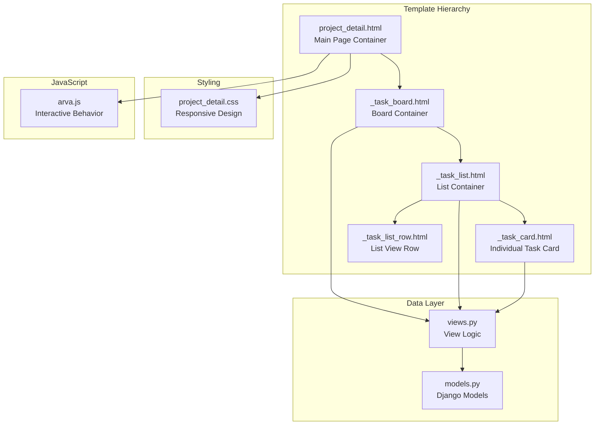
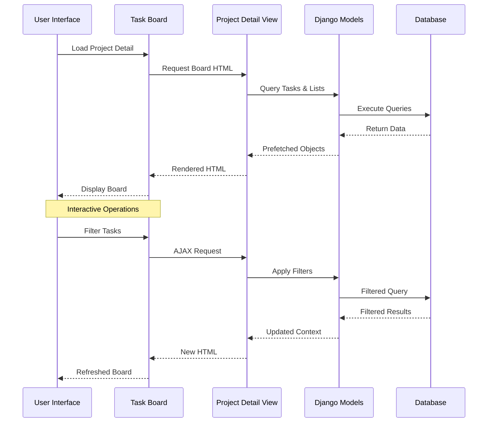
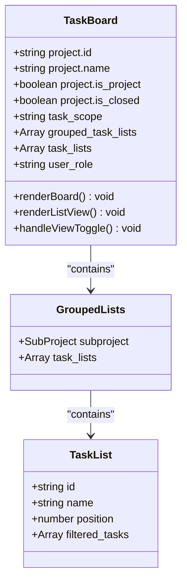
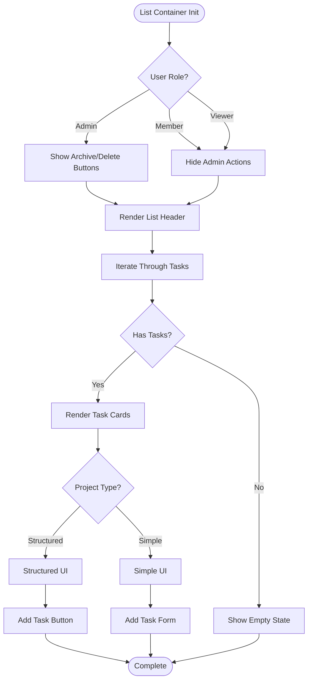
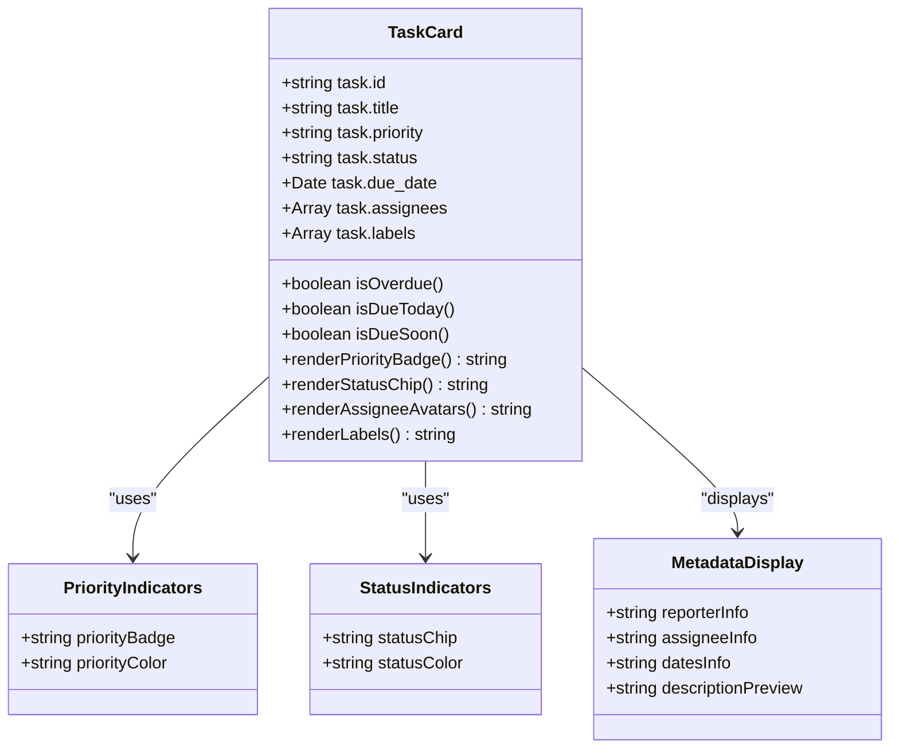
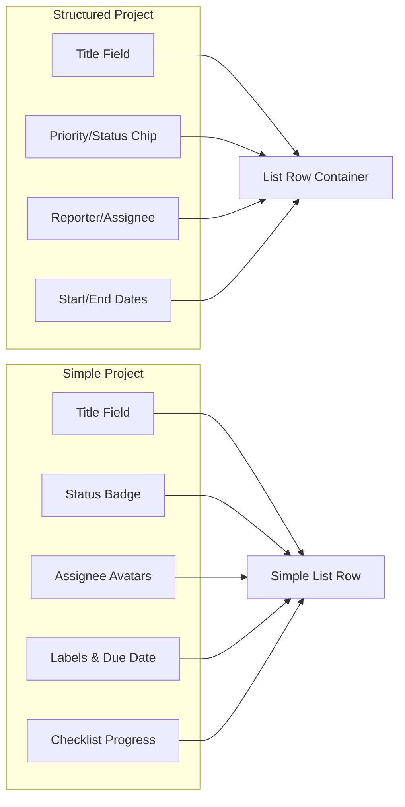
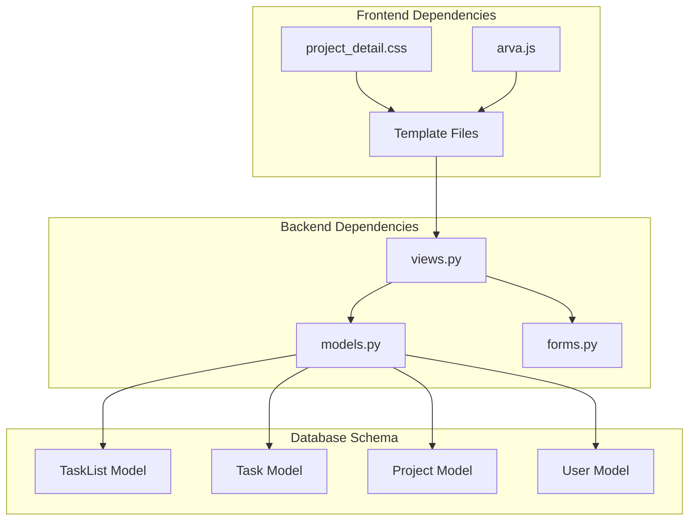

# Kanban Board Interface

<cite>
**Referenced Files in This Document**
- [project_detail.html](file://arva/templates/arva/project_detail.html)
- [_task_board.html](file://arva/templates/arva/_task_board.html)
- [_task_list.html](file://arva/templates/arva/_task_list.html)
- [_task_card.html](file://arva/templates/arva/_task_card.html)
- [_task_list_row.html](file://arva/templates/arva/_task_list_row.html)
- [project_detail.css](file://static/arva/css/pages/project_detail.css)
- [arva.js](file://static/arva/js/arva.js)
- [models.py](file://arva/models.py)
- [views.py](file://arva/views.py)
- [base.html](file://arva/templates/arva/base.html)
</cite>

## Table of Contents
1. [Introduction](#introduction)
2. [Project Structure](#project-structure)
3. [Core Components](#core-components)
4. [Architecture Overview](#architecture-overview)
5. [Detailed Component Analysis](#detailed-component-analysis)
6. [Dependency Analysis](#dependency-analysis)
7. [Performance Considerations](#performance-considerations)
8. [Troubleshooting Guide](#troubleshooting-guide)
9. [Conclusion](#conclusion)

## Introduction
The kanban board interface is a central feature of the project management system, providing a visual workflow management solution. This documentation explains how the board renders task lists as columns and individual tasks as draggable cards, with comprehensive data binding between Django models and templates, responsive design implementation, visual indicators for priorities and statuses, and integration with the project filtering system.

## Project Structure
The kanban board implementation follows a hierarchical template structure with clear separation of concerns:

**Diagram sources**
- [project_detail.html](file://arva/templates/arva/project_detail.html#L1-L581)
- [_task_board.html](file://arva/templates/arva/_task_board.html#L1-L176)
- [_task_list.html](file://arva/templates/arva/_task_list.html#L1-L52)
- [_task_card.html](file://arva/templates/arva/_task_card.html#L1-L185)
- [_task_list_row.html](file://arva/templates/arva/_task_list_row.html#L1-L126)
- [project_detail.css](file://static/arva/css/pages/project_detail.css#L1-L482)
- [arva.js](file://static/arva/js/arva.js#L780-L1087)
- [views.py](file://arva/views.py#L713-L884)
- [models.py](file://arva/models.py#L238-L311)

**Section sources**
- [project_detail.html](file://arva/templates/arva/project_detail.html#L1-L581)
- [base.html](file://arva/templates/arva/base.html#L1-L362)

## Core Components

### Board Layout Structure
The kanban board consists of three primary layout modes controlled by the view switching mechanism:

1. **Card View Mode**: Displays task lists as horizontal columns with individual task cards
2. **List View Mode**: Shows tasks in a tabular format with detailed metadata
3. **Hybrid Filtering**: Real-time filtering across both views

The board container manages two distinct panels that toggle based on user preference, with persistent storage of view preferences.

**Section sources**
- [project_detail.html](file://arva/templates/arva/project_detail.html#L155-L166)
- [arva.js](file://static/arva/js/arva.js#L807-L820)

### Template Hierarchy Implementation
The template hierarchy creates a modular structure:

- `_task_board.html`: Main container with data attributes for project context
- `_task_list.html`: Individual list column with task iteration
- `_task_card.html`: Individual task item with comprehensive metadata
- `_task_list_row.html`: Alternative list view representation

Each template receives specific context variables and handles role-based visibility.

**Section sources**
- [_task_board.html](file://arva/templates/arva/_task_board.html#L1-L176)
- [_task_list.html](file://arva/templates/arva/_task_list.html#L1-L52)
- [_task_card.html](file://arva/templates/arva/_task_card.html#L1-L185)
- [_task_list_row.html](file://arva/templates/arva/_task_list_row.html#L1-L126)

### Data Binding Architecture
The system binds Django models to templates through carefully designed context variables:

- **Project Context**: Project metadata, progress indicators, and access control
- **Task Lists**: Ordered by position with subproject grouping
- **Tasks**: Filtered by current selections with prefetch relationships
- **User Roles**: Admin/member/viewer permissions affecting UI elements

**Section sources**
- [views.py](file://arva/views.py#L713-L884)
- [models.py](file://arva/models.py#L238-L311)

## Architecture Overview

**Diagram sources**
- [views.py](file://arva/views.py#L713-L884)
- [project_detail.html](file://arva/templates/arva/project_detail.html#L239-L241)
- [_task_board.html](file://arva/templates/arva/_task_board.html#L880-L882)

## Detailed Component Analysis

### Task Board Container (_task_board.html)
The main board container provides comprehensive project context and dual view capabilities:

**Diagram sources**
- [_task_board.html](file://arva/templates/arva/_task_board.html#L1-L176)
- [views.py](file://arva/views.py#L789-L811)

Key features include:
- Project header with progress indicators
- Subproject scoping for multi-project environments
- Dual view mode switching
- Role-based UI element visibility
- Empty state handling for both card and list views

**Section sources**
- [_task_board.html](file://arva/templates/arva/_task_board.html#L1-L176)
- [views.py](file://arva/views.py#L789-L811)

### Task List Container (_task_list.html)
Individual list containers manage task organization and user interactions:

**Diagram sources**
- [_task_list.html](file://arva/templates/arva/_task_list.html#L1-L52)

**Section sources**
- [_task_list.html](file://arva/templates/arva/_task_list.html#L1-L52)

### Task Card Representation (_task_card.html)
Individual task cards display comprehensive metadata with role-based visibility:

**Diagram sources**
- [_task_card.html](file://arva/templates/arva/_task_card.html#L1-L185)

**Section sources**
- [_task_card.html](file://arva/templates/arva/_task_card.html#L1-L185)

### List View Implementation (_task_list_row.html)
Alternative list view provides tabular task representation:

**Diagram sources**
- [_task_list_row.html](file://arva/templates/arva/_task_list_row.html#L1-L126)

**Section sources**
- [_task_list_row.html](file://arva/templates/arva/_task_list_row.html#L1-L126)

## Dependency Analysis

**Diagram sources**
- [views.py](file://arva/views.py#L19-L31)
- [models.py](file://arva/models.py#L238-L311)
- [project_detail.css](file://static/arva/css/pages/project_detail.css#L1-L482)
- [arva.js](file://static/arva/js/arva.js#L780-L1087)

### Data Flow Patterns
The system implements several key data flow patterns:

1. **Prefetch Relationships**: Optimized database queries with select_related and prefetch_related
2. **Context Building**: Dynamic context construction based on user roles and project types
3. **Filter Application**: Real-time filtering with AJAX requests
4. **State Management**: Persistent view preferences and filter states

**Section sources**
- [views.py](file://arva/views.py#L747-L783)
- [models.py](file://arva/models.py#L238-L311)

## Performance Considerations

### Database Optimization
The system employs several optimization strategies:

- **Prefetch Relationships**: Using select_related and prefetch_related to minimize N+1 queries
- **Filtered Query Sets**: Applying filters at query time rather than in Python
- **Pagination**: Efficient pagination for list view with configurable page sizes
- **Indexing**: Strategic use of database indexes on frequently queried fields

### Frontend Performance
- **Lazy Loading**: Skeleton loaders during AJAX operations
- **Local Storage**: Persistent state caching for view preferences
- **Event Delegation**: Efficient event handling for dynamic content
- **CSS Grid**: Modern layout implementation for optimal rendering

### Memory Management
- **Template Caching**: Efficient template rendering with minimal DOM manipulation
- **Resource Cleanup**: Proper cleanup of event listeners and modal states
- **Image Optimization**: Avatar fallback system reduces bandwidth usage

## Troubleshooting Guide

### Common Issues and Solutions

#### Board Not Rendering Tasks
**Symptoms**: Empty board or loading spinner
**Causes**: 
- Missing task filters or invalid project context
- Database query failures
- JavaScript initialization errors

**Solutions**:
1. Verify project ID and scope parameters
2. Check database connectivity and query permissions
3. Review browser console for JavaScript errors
4. Validate CSRF token presence in forms

#### Task Creation Failures
**Symptoms**: Error messages when adding new tasks
**Causes**:
- Validation errors in task creation form
- Missing required fields for structured projects
- Permission issues for closed projects

**Solutions**:
1. Ensure all required fields are filled for structured projects
2. Verify project is not locked (closed)
3. Check user role permissions
4. Validate date constraints (start date ≤ end date)

#### View Switching Problems
**Symptoms**: Board not switching between card and list views
**Causes**:
- Local storage conflicts
- JavaScript initialization failures
- CSS class conflicts

**Solutions**:
1. Clear browser local storage for project detail preferences
2. Reload page to reinitialize JavaScript components
3. Check for CSS conflicts in custom themes
4. Verify Bootstrap modal initialization

**Section sources**
- [arva.js](file://static/arva/js/arva.js#L807-L820)
- [views.py](file://arva/views.py#L713-L884)

## Conclusion

The kanban board interface demonstrates a sophisticated implementation of modern project management UI patterns. The modular template architecture, comprehensive data binding, responsive design, and robust filtering system work together to provide an intuitive and efficient task management experience.

Key strengths of the implementation include:
- **Modular Design**: Clean separation of concerns with reusable template components
- **Performance Optimization**: Careful database query optimization and frontend resource management
- **User Experience**: Responsive design with smooth transitions and intuitive interactions
- **Extensibility**: Well-defined patterns for adding new features and customization

The system successfully balances functionality with maintainability, providing a solid foundation for future enhancements while delivering a polished user experience across different device sizes and interaction patterns.