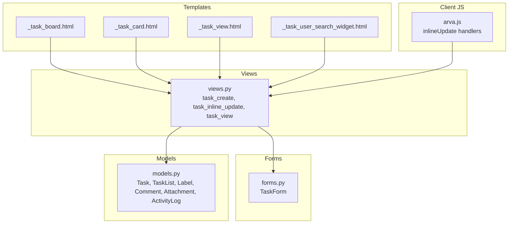
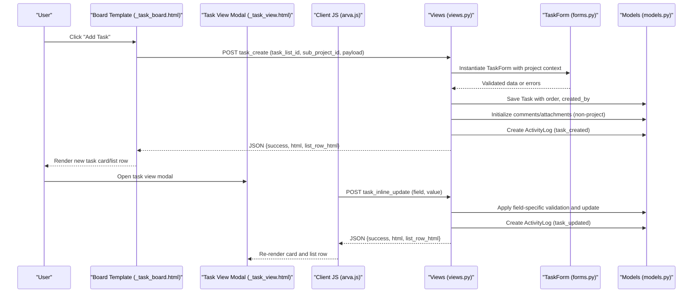
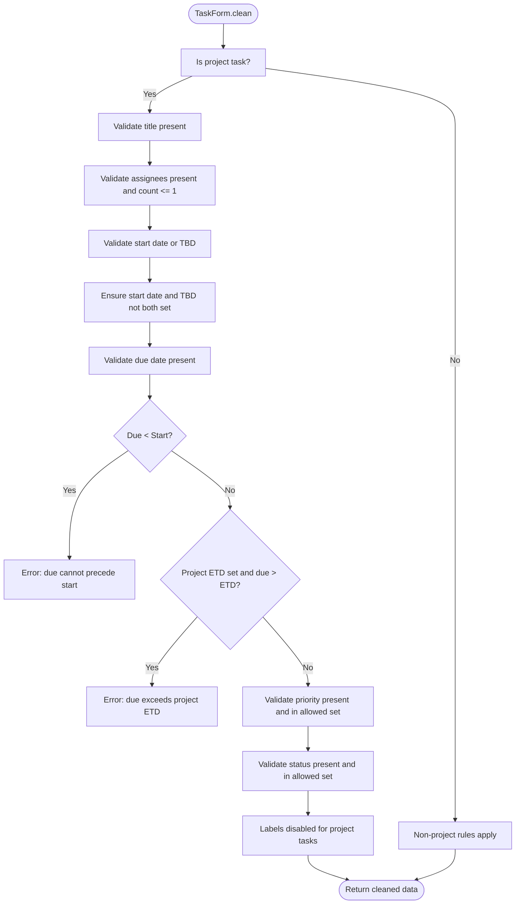
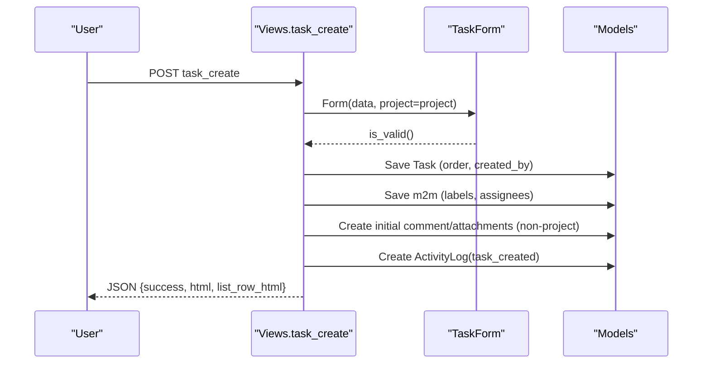
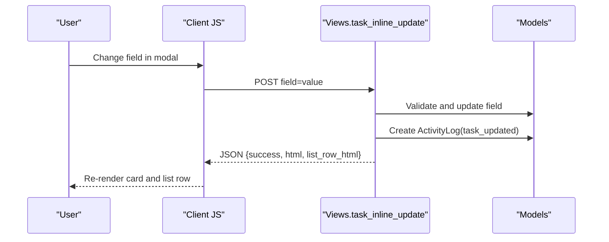
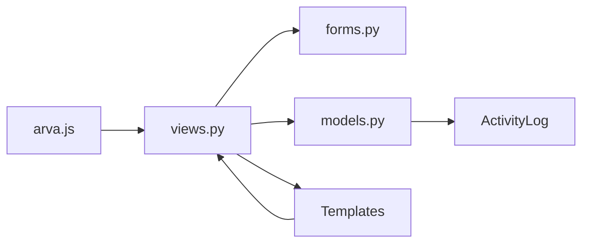

# Task Creation and Editing

<cite>
**Referenced Files in This Document**
- [models.py](file://arva/models.py)
- [forms.py](file://arva/forms.py)
- [views.py](file://arva/views.py)
- [_task_board.html](file://arva/templates/arva/_task_board.html)
- [_task_card.html](file://arva/templates/arva/_task_card.html)
- [_task_view.html](file://arva/templates/arva/_task_view.html)
- [_task_user_search_widget.html](file://arva/templates/arva/_task_user_search_widget.html)
- [arva.js](file://static/arva/js/arva.js)
</cite>

## Table of Contents
1. [Introduction](#introduction)
2. [Project Structure](#project-structure)
3. [Core Components](#core-components)
4. [Architecture Overview](#architecture-overview)
5. [Detailed Component Analysis](#detailed-component-analysis)
6. [Dependency Analysis](#dependency-analysis)
7. [Performance Considerations](#performance-considerations)
8. [Troubleshooting Guide](#troubleshooting-guide)
9. [Conclusion](#conclusion)

## Introduction
This document explains the task creation and editing workflows in the application. It covers the TaskForm implementation and validation logic, required fields, data types, and business rules. It documents the end-to-end task creation process from form submission through database persistence, including default status assignment and initial ordering. It also details the edit functionality for modifying task properties such as title, description, due dates, assignees, labels, and priority levels. The AJAX-driven modal interface for inline editing, the user search widget for adding assignees, and real-time validation feedback are included. Examples of task creation scenarios, bulk operations, and integration with the activity logging system are provided. Error handling, form persistence during validation failures, and the relationship between task creation and checklist/comment initialization are addressed.

## Project Structure
The task system spans models, forms, views, templates, and client-side JavaScript. The board view renders lists and cards, while the task view modal supports inline editing. Validation occurs in forms and views, and activity logs record lifecycle events.

**Diagram sources**
- [_task_board.html](file://arva/templates/arva/_task_board.html#L1-L176)
- [_task_card.html](file://arva/templates/arva/_task_card.html#L1-L185)
- [_task_view.html](file://arva/templates/arva/_task_view.html#L1-L314)
- [_task_user_search_widget.html](file://arva/templates/arva/_task_user_search_widget.html#L1-L14)
- [views.py](file://arva/views.py#L1325-L1693)
- [forms.py](file://arva/forms.py#L206-L292)
- [models.py](file://arva/models.py#L252-L422)
- [arva.js](file://static/arva/js/arva.js#L1557-L1600)

**Section sources**
- [views.py](file://arva/views.py#L1325-L1693)
- [_task_board.html](file://arva/templates/arva/_task_board.html#L1-L176)
- [_task_card.html](file://arva/templates/arva/_task_card.html#L1-L185)
- [_task_view.html](file://arva/templates/arva/_task_view.html#L1-L314)
- [_task_user_search_widget.html](file://arva/templates/arva/_task_user_search_widget.html#L1-L14)
- [forms.py](file://arva/forms.py#L206-L292)
- [models.py](file://arva/models.py#L252-L422)
- [arva.js](file://static/arva/js/arva.js#L1557-L1600)

## Core Components
- Task model defines properties, statuses, priorities, and metadata. It includes computed fields for checklist progress and overdue/due indicators.
- TaskForm encapsulates validation rules for task creation/editing, including required fields, constraints for project vs. non-project tasks, and date range checks.
- Views implement task creation, inline editing, and task view rendering. They enforce permissions, apply business rules, and log activities.
- Templates render the board, task cards, and the task view modal with inline-editable fields.
- Client-side JavaScript handles inline updates via AJAX and triggers re-rendering of affected UI.

Key responsibilities:
- Validation: TaskForm.clean enforces required fields and cross-field constraints.
- Persistence: task_create saves the task with default order and created_by, and initializes comments/attachments for non-project tasks.
- Inline editing: task_inline_update updates individual fields with strict validation and activity logging.
- UI integration: Templates expose editable fields and the modal for inline editing; JS binds change events to call inlineUpdate.

**Section sources**
- [models.py](file://arva/models.py#L252-L352)
- [forms.py](file://arva/forms.py#L206-L292)
- [views.py](file://arva/views.py#L1542-L1693)
- [_task_view.html](file://arva/templates/arva/_task_view.html#L1-L314)
- [arva.js](file://static/arva/js/arva.js#L1557-L1600)

## Architecture Overview
The task creation and editing pipeline integrates front-end and back-end components:

**Diagram sources**
- [_task_board.html](file://arva/templates/arva/_task_board.html#L114-L176)
- [_task_view.html](file://arva/templates/arva/_task_view.html#L1-L314)
- [arva.js](file://static/arva/js/arva.js#L1557-L1600)
- [views.py](file://arva/views.py#L1542-L1693)
- [forms.py](file://arva/forms.py#L206-L292)
- [models.py](file://arva/models.py#L252-L422)

## Detailed Component Analysis

### TaskForm Implementation and Validation Logic
TaskForm governs validation for task creation and editing. It sets project-aware choices for priority and status, and applies business rules depending on whether the project is structured (is_project).

Required fields and constraints:
- Title: Required for project tasks; empty triggers an error.
- Assignees: Required for project tasks; only one assignee allowed.
- Start date: Required for project tasks unless marked TBD; mutually exclusive with TBD.
- Due date: Required for project tasks; cannot precede start date; cannot exceed project ETD if set.
- Priority: Required for project tasks; must be one of the structured priority levels.
- Status: Required for project tasks; must be one of the structured status values.
- Labels: Disabled for project tasks; attempting to set labels raises an error.
- Cover color: Optional; cleared for project tasks.

Validation behavior:
- Project tasks disable labels and cover color; non-project tasks retain label support and cover color.
- Default priority is set to a structured level when missing for project tasks.
- Cross-field validations ensure temporal consistency and scope alignment.

**Diagram sources**
- [forms.py](file://arva/forms.py#L206-L292)

**Section sources**
- [forms.py](file://arva/forms.py#L206-L292)

### Task Creation Workflow
The task creation endpoint orchestrates persistence and initialization:

- Endpoint: task_create
- Responsibilities:
  - Validate list and sub-project scope.
  - Instantiate TaskForm with project context.
  - Set defaults: priority, order, created_by.
  - Persist task and many-to-many relationships.
  - Initialize comments and attachments for non-project tasks.
  - Record activity log.
  - Return rendered HTML for card and list row.

Default status and ordering:
- Default status is set to a neutral value for project tasks.
- Order is set to the next integer after the highest existing order in the target list.
- created_by is set to the current user.

Initialization of checklist/comment:
- For non-project tasks, initial comment and uploaded files are processed and saved.
- Project tasks do not initialize comments/attachments in the creation flow.

**Diagram sources**
- [views.py](file://arva/views.py#L1542-L1600)
- [forms.py](file://arva/forms.py#L206-L292)
- [models.py](file://arva/models.py#L252-L312)

**Section sources**
- [views.py](file://arva/views.py#L1542-L1600)
- [models.py](file://arva/models.py#L252-L312)

### Edit Functionality and Inline Updates
The inline editing endpoint updates individual task fields with strict validation and activity logging:

- Endpoint: task_inline_update
- Supported fields:
  - title, description
  - status (project tasks only accept structured statuses)
  - start_date, start_date_tbd
  - due_date (enforced against start date and project ETD)
  - priority (project tasks only accept structured priorities)
  - assignees (project tasks restrict to one assignee)
  - labels (disabled for project tasks)
  - cover_color
- Behavior:
  - Enforces project-aware constraints per field.
  - Updates assignees and ensures membership creation for newly added assignees.
  - Emits activity log entries for each update.
  - Returns updated card and list row HTML.

**Diagram sources**
- [_task_view.html](file://arva/templates/arva/_task_view.html#L1-L314)
- [arva.js](file://static/arva/js/arva.js#L1557-L1600)
- [views.py](file://arva/views.py#L1394-L1538)
- [models.py](file://arva/models.py#L252-L422)

**Section sources**
- [views.py](file://arva/views.py#L1394-L1538)
- [_task_view.html](file://arva/templates/arva/_task_view.html#L1-L314)
- [arva.js](file://static/arva/js/arva.js#L1557-L1600)

### AJAX-Driven Modal Interface and Real-Time Feedback
The task view modal exposes inline-editable fields. Client-side handlers bind to change events and call the inline update endpoint. On success, the UI refreshes the task card and list row to reflect changes.

- Modal fields:
  - Title, description, status, priority, start date, due date, assignees, labels (non-project), cover color.
- Client behavior:
  - Handlers serialize field/value pairs and call inlineUpdate.
  - On success, loadTaskView is invoked to refresh the modal content.
- Real-time feedback:
  - Errors are returned as JSON with error messages.
  - Successful updates return updated HTML fragments for immediate UI refresh.

**Section sources**
- [_task_view.html](file://arva/templates/arva/_task_view.html#L1-L314)
- [arva.js](file://static/arva/js/arva.js#L1557-L1600)
- [views.py](file://arva/views.py#L1394-L1538)

### User Search Widget for Adding Assignees
The user search widget enables filtering users by username or email. It is integrated into the task view modal for selecting assignees.

- Widget template:
  - Provides an input and results container for search results.
- Integration:
  - Used within the assignees selector in the task view modal to filter users.
- Behavior:
  - Supports live search and selection of users to add as assignees.

**Section sources**
- [_task_user_search_widget.html](file://arva/templates/arva/_task_user_search_widget.html#L1-L14)
- [_task_view.html](file://arva/templates/arva/_task_view.html#L39-L56)

### Task View Rendering and Card Presentation
The task view modal and task card templates render task details and editable fields. The card template displays metadata, labels, checklist progress, and actions.

- Task view modal:
  - Presents structured fields for project tasks and additional sections for non-project tasks.
  - Includes comment and attachment areas.
- Task card:
  - Shows priority/status chips, assignee avatars, due date badges, and checklist progress.
  - Provides action buttons for viewing, moving, archiving, and deleting tasks.

**Section sources**
- [_task_view.html](file://arva/templates/arva/_task_view.html#L1-L314)
- [_task_card.html](file://arva/templates/arva/_task_card.html#L1-L185)

### Activity Logging Integration
Activity logs capture lifecycle events for tasks and projects. During task creation and inline updates, appropriate actions are recorded.

- Creation:
  - Action: task_created
  - Description includes task title and project context.
- Inline updates:
  - Action: task_updated
  - Description reflects the specific field updated.
- Additional actions:
  - Project-related actions (e.g., project_created, project_updated) are logged elsewhere.

**Section sources**
- [models.py](file://arva/models.py#L387-L422)
- [views.py](file://arva/views.py#L1585-L1588)
- [views.py](file://arva/views.py#L1534-L1535)

## Dependency Analysis
The task system exhibits clear separation of concerns across models, forms, views, templates, and client-side scripts.

**Diagram sources**
- [arva.js](file://static/arva/js/arva.js#L1557-L1600)
- [views.py](file://arva/views.py#L1325-L1693)
- [forms.py](file://arva/forms.py#L206-L292)
- [models.py](file://arva/models.py#L252-L422)
- [_task_board.html](file://arva/templates/arva/_task_board.html#L1-L176)
- [_task_view.html](file://arva/templates/arva/_task_view.html#L1-L314)

**Section sources**
- [views.py](file://arva/views.py#L1325-L1693)
- [forms.py](file://arva/forms.py#L206-L292)
- [models.py](file://arva/models.py#L252-L422)
- [_task_board.html](file://arva/templates/arva/_task_board.html#L1-L176)
- [_task_view.html](file://arva/templates/arva/_task_view.html#L1-L314)
- [arva.js](file://static/arva/js/arva.js#L1557-L1600)

## Performance Considerations
- Minimize database queries by using select_related and prefetch_related in views to reduce N+1 issues.
- Batch updates for task ordering and list reordering leverage CASE/WHEN expressions to avoid per-record writes.
- Activity logging is lightweight and scoped to critical events; ensure indexing on frequently filtered fields if logs grow large.
- Client-side rendering of HTML fragments reduces full-page reloads and improves perceived responsiveness.

## Troubleshooting Guide
Common issues and resolutions:
- Validation errors on creation:
  - Ensure required fields are present and meet cross-field constraints (e.g., due date not before start date).
  - For project tasks, confirm assignees count and priority/status values are valid.
- Inline update failures:
  - Verify the field name is supported and the value adheres to project-aware constraints.
  - Confirm the user has permission to edit the task (owner/admin or assignee).
- Permission denied:
  - Only owners/admins or assignees can edit tasks; locked projects prevent edits.
- Activity logs not appearing:
  - Confirm the action is recorded for creation and updates; verify filtering criteria in the activity log view.

**Section sources**
- [views.py](file://arva/views.py#L1542-L1600)
- [views.py](file://arva/views.py#L1394-L1538)
- [views.py](file://arva/views.py#L1014-L1053)

## Conclusion
The task creation and editing workflows combine robust server-side validation with a responsive, AJAX-driven client interface. TaskForm enforces required fields and business rules, while views manage persistence, initialization, and activity logging. The modal-based inline editing provides immediate feedback and seamless updates. Together, these components deliver a reliable and user-friendly task management experience.