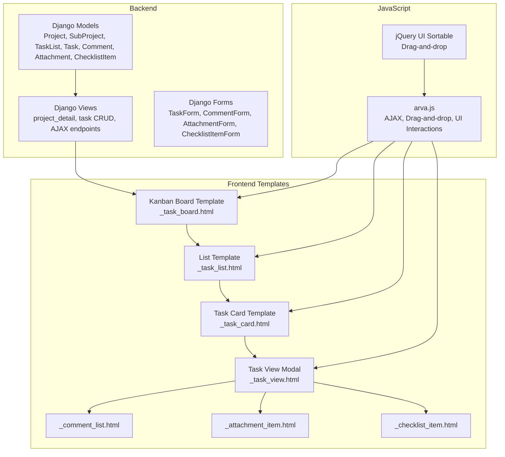
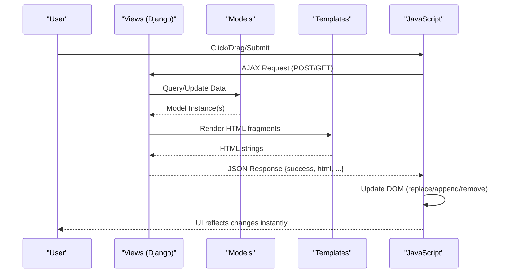
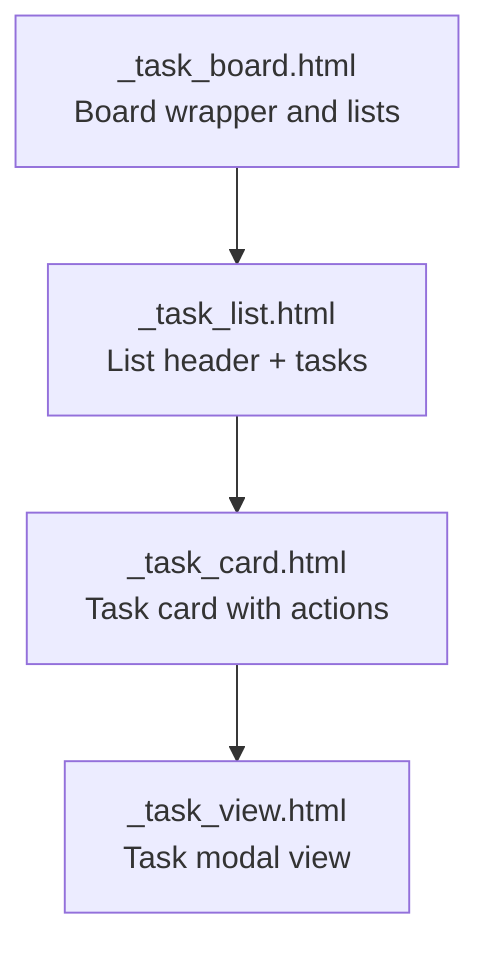
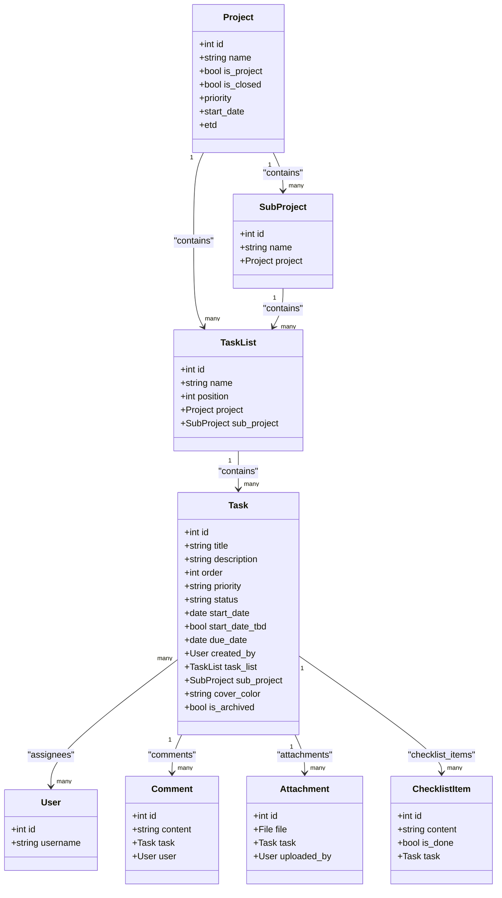
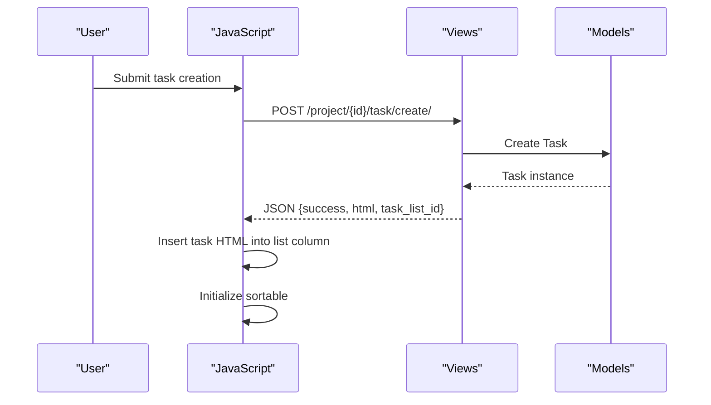
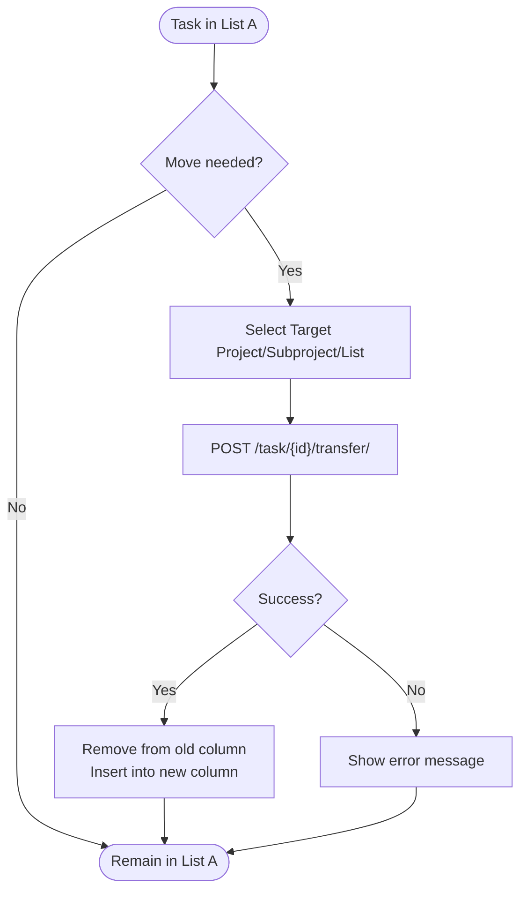
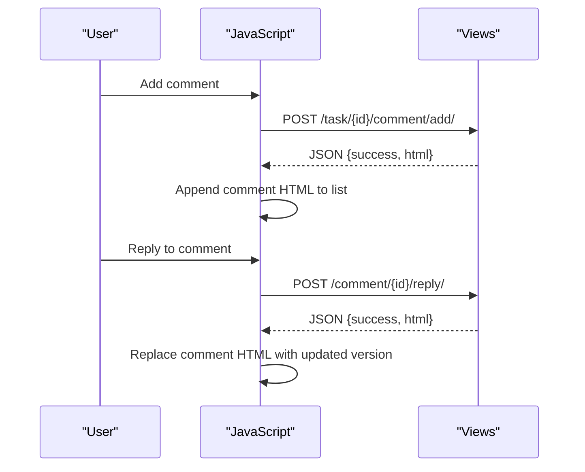
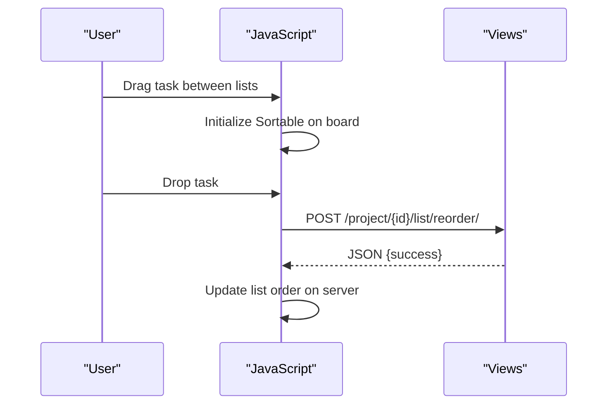
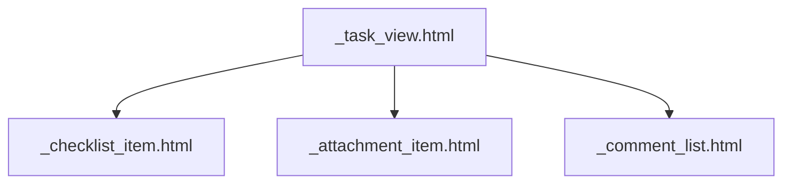
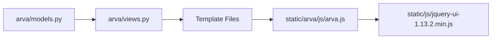

# Task Management System

<cite>
**Referenced Files in This Document**
- [arva/models.py](file://arva/models.py)
- [arva/views.py](file://arva/views.py)
- [arva/forms.py](file://arva/forms.py)
- [arva/templates/arva/project_detail.html](file://arva/templates/arva/project_detail.html)
- [arva/templates/arva/_task_board.html](file://arva/templates/arva/_task_board.html)
- [arva/templates/arva/_task_list.html](file://arva/templates/arva/_task_list.html)
- [arva/templates/arva/_task_card.html](file://arva/templates/arva/_task_card.html)
- [arva/templates/arva/_task_view.html](file://arva/templates/arva/_task_view.html)
- [arva/templates/arva/_comment_list.html](file://arva/templates/arva/_comment_list.html)
- [arva/templates/arva/_comment_item.html](file://arva/templates/arva/_comment_item.html)
- [arva/templates/arva/_attachment_item.html](file://arva/templates/arva/_attachment_item.html)
- [arva/templates/arva/_checklist_item.html](file://arva/templates/arva/_checklist_item.html)
- [static/arva/js/arva.js](file://static/arva/js/arva.js)
- [static/js/jquery-ui-1.13.2.min.js](file://static/js/jquery-ui-1.13.2.min.js)
</cite>

## Table of Contents
1. [Introduction](#introduction)
2. [Project Structure](#project-structure)
3. [Core Components](#core-components)
4. [Architecture Overview](#architecture-overview)
5. [Detailed Component Analysis](#detailed-component-analysis)
6. [Dependency Analysis](#dependency-analysis)
7. [Performance Considerations](#performance-considerations)
8. [Troubleshooting Guide](#troubleshooting-guide)
9. [Conclusion](#conclusion)

## Introduction
This document describes the task management system in Arva Kanban, focusing on the kanban board implementation with drag-and-drop functionality, task creation and editing processes, and task status management across columns/lists. It explains the hierarchical relationship between tasks, task lists, and projects, along with assignees and comments. The document also covers the AJAX-driven interface enabling real-time updates without page reloads, including JavaScript implementations for drag-and-drop reordering and dynamic content updates. Concrete examples illustrate how tasks flow through different states, how the UI responds to user interactions, and how the backend processes task modifications. Additional coverage includes task metadata management, checklist functionality, attachment handling, and the comment system. Finally, troubleshooting guidance addresses common issues such as drag-and-drop conflicts and AJAX update failures.

## Project Structure
The task management system spans Django models and views for backend logic, HTML templates for frontend rendering, and JavaScript for interactive features and AJAX communication. The kanban board is composed of:
- Projects containing SubProjects and TaskLists
- TaskLists containing Tasks
- Tasks with metadata, assignees, labels, comments, attachments, and checklists

**Diagram sources**
- [arva/models.py](file://arva/models.py#L101-L386)
- [arva/views.py](file://arva/views.py#L707-L884)
- [arva/forms.py](file://arva/forms.py#L206-L326)
- [arva/templates/arva/_task_board.html](file://arva/templates/arva/_task_board.html#L1-L176)
- [arva/templates/arva/_task_list.html](file://arva/templates/arva/_task_list.html#L1-L52)
- [arva/templates/arva/_task_card.html](file://arva/templates/arva/_task_card.html#L1-L185)
- [arva/templates/arva/_task_view.html](file://arva/templates/arva/_task_view.html#L1-L314)
- [arva/templates/arva/_comment_list.html](file://arva/templates/arva/_comment_list.html)
- [arva/templates/arva/_attachment_item.html](file://arva/templates/arva/_attachment_item.html)
- [arva/templates/arva/_checklist_item.html](file://arva/templates/arva/_checklist_item.html)
- [static/arva/js/arva.js](file://static/arva/js/arva.js#L2654-L2655)
- [static/js/jquery-ui-1.13.2.min.js](file://static/js/jquery-ui-1.13.2.min.js#L1-L5)

**Section sources**
- [arva/models.py](file://arva/models.py#L101-L386)
- [arva/views.py](file://arva/views.py#L707-L884)
- [arva/forms.py](file://arva/forms.py#L206-L326)
- [arva/templates/arva/_task_board.html](file://arva/templates/arva/_task_board.html#L1-L176)
- [arva/templates/arva/_task_list.html](file://arva/templates/arva/_task_list.html#L1-L52)
- [arva/templates/arva/_task_card.html](file://arva/templates/arva/_task_card.html#L1-L185)
- [arva/templates/arva/_task_view.html](file://arva/templates/arva/_task_view.html#L1-L314)
- [arva/templates/arva/_comment_list.html](file://arva/templates/arva/_comment_list.html)
- [arva/templates/arva/_attachment_item.html](file://arva/templates/arva/_attachment_item.html)
- [arva/templates/arva/_checklist_item.html](file://arva/templates/arva/_checklist_item.html)
- [static/arva/js/arva.js](file://static/arva/js/arva.js#L2654-L2655)
- [static/js/jquery-ui-1.13.2.min.js](file://static/js/jquery-ui-1.13.2.min.js#L1-L5)

## Core Components
- Models: Define the data hierarchy and relationships among Projects, SubProjects, TaskLists, Tasks, Comments, Attachments, and ChecklistItems. They include validation logic for structured projects and computed properties for progress and overdue indicators.
- Views: Render the kanban board and list views, handle AJAX requests for task creation, updates, movement, comments, attachments, and checklists, and enforce access control.
- Forms: Provide validation and constraints for task creation/editing, including structured project requirements and legacy priority/status compatibility.
- Templates: Compose the board, lists, cards, and task view modal, integrating metadata, comments, attachments, and checklists.
- JavaScript: Implements AJAX endpoints, drag-and-drop reordering via jQuery UI Sortable, dynamic content updates, and modal interactions.

**Section sources**
- [arva/models.py](file://arva/models.py#L101-L386)
- [arva/views.py](file://arva/views.py#L707-L884)
- [arva/forms.py](file://arva/forms.py#L206-L326)
- [arva/templates/arva/_task_board.html](file://arva/templates/arva/_task_board.html#L1-L176)
- [arva/templates/arva/_task_list.html](file://arva/templates/arva/_task_list.html#L1-L52)
- [arva/templates/arva/_task_card.html](file://arva/templates/arva/_task_card.html#L1-L185)
- [arva/templates/arva/_task_view.html](file://arva/templates/arva/_task_view.html#L1-L314)
- [static/arva/js/arva.js](file://static/arva/js/arva.js#L2654-L2655)

## Architecture Overview
The system follows a client-server architecture:
- Backend: Django handles routing, authentication, authorization, data persistence, and response generation.
- Frontend: Templates render the UI; JavaScript manages user interactions, AJAX calls, and DOM updates.
- Data flow: User actions trigger JavaScript handlers that call backend endpoints; successful responses update the DOM without full page reloads.

**Diagram sources**
- [arva/views.py](file://arva/views.py#L707-L884)
- [arva/models.py](file://arva/models.py#L252-L386)
- [arva/templates/arva/_task_board.html](file://arva/templates/arva/_task_board.html#L1-L176)
- [arva/templates/arva/_task_view.html](file://arva/templates/arva/_task_view.html#L1-L314)
- [static/arva/js/arva.js](file://static/arva/js/arva.js#L1493-L1519)

## Detailed Component Analysis

### Kanban Board Implementation
The kanban board is rendered by the project detail view and composed of:
- Board wrapper with project and optional subproject context
- Multiple lists (columns) representing task states
- Cards representing individual tasks with metadata and actions

Key behaviors:
- Card view vs list view toggling
- Adding new lists and tasks
- Inline editing of task properties
- Drag-and-drop reordering of tasks and lists
- Modal-based task viewing and editing

**Diagram sources**
- [arva/templates/arva/_task_board.html](file://arva/templates/arva/_task_board.html#L1-L176)
- [arva/templates/arva/_task_list.html](file://arva/templates/arva/_task_list.html#L1-L52)
- [arva/templates/arva/_task_card.html](file://arva/templates/arva/_task_card.html#L1-L185)
- [arva/templates/arva/_task_view.html](file://arva/templates/arva/_task_view.html#L1-L314)

**Section sources**
- [arva/templates/arva/_task_board.html](file://arva/templates/arva/_task_board.html#L1-L176)
- [arva/templates/arva/_task_list.html](file://arva/templates/arva/_task_list.html#L1-L52)
- [arva/templates/arva/_task_card.html](file://arva/templates/arva/_task_card.html#L1-L185)
- [arva/templates/arva/_task_view.html](file://arva/templates/arva/_task_view.html#L1-L314)

### Task Hierarchy and Relationships
Tasks belong to TaskLists within Projects (and optionally SubProjects). The hierarchy supports:
- Structured projects with strict status/priority constraints
- Non-structured projects with labels and due dates
- Assignees, labels, comments, attachments, and checklists per task

**Diagram sources**
- [arva/models.py](file://arva/models.py#L101-L386)

**Section sources**
- [arva/models.py](file://arva/models.py#L101-L386)

### Task Creation and Editing Processes
- Creation: Users can add tasks via list forms (card view) or list view modal. Validation ensures required fields for structured projects.
- Editing: Inline editing of title, description, due date, priority, status, start date/TBD, assignees, and labels. Updates are persisted via AJAX and reflected immediately.

**Diagram sources**
- [arva/views.py](file://arva/views.py#L707-L884)
- [arva/forms.py](file://arva/forms.py#L206-L292)
- [static/arva/js/arva.js](file://static/arva/js/arva.js#L1028-L1086)

**Section sources**
- [arva/views.py](file://arva/views.py#L707-L884)
- [arva/forms.py](file://arva/forms.py#L206-L292)
- [static/arva/js/arva.js](file://static/arva/js/arva.js#L1028-L1086)

### Task Status Management Across Columns
- Structured projects: Status constrained to predefined values (e.g., In Progress, Done, Infeasible).
- Non-structured projects: Tasks are organized by TaskList positions, with labels and due dates.
- Movement: Tasks can be transferred between projects, subprojects, and lists via the task view modal.

**Diagram sources**
- [arva/views.py](file://arva/views.py#L707-L884)
- [static/arva/js/arva.js](file://static/arva/js/arva.js#L1728-L1810)

**Section sources**
- [arva/views.py](file://arva/views.py#L707-L884)
- [static/arva/js/arva.js](file://static/arva/js/arva.js#L1728-L1810)

### Assignees and Comments
- Assignees: Managed via dropdowns in the task view; structured projects limit to a single assignee.
- Comments: Real-time addition and replies; nested comments supported with reply forms.
- Permissions: Access control prevents unauthorized edits or deletions.

**Diagram sources**
- [arva/views.py](file://arva/views.py#L707-L884)
- [static/arva/js/arva.js](file://static/arva/js/arva.js#L1812-L1890)

**Section sources**
- [arva/views.py](file://arva/views.py#L707-L884)
- [arva/templates/arva/_comment_list.html](file://arva/templates/arva/_comment_list.html)
- [arva/templates/arva/_comment_item.html](file://arva/templates/arva/_comment_item.html)
- [static/arva/js/arva.js](file://static/arva/js/arva.js#L1812-L1890)

### AJAX-Driven Interface and Drag-and-Drop
- CSRF protection: All AJAX requests include CSRF token.
- Drag-and-drop: Implemented with jQuery UI Sortable for tasks and lists; server-side reordering persists order.
- Dynamic updates: Responses return HTML fragments to update specific DOM nodes without full reloads.

**Diagram sources**
- [static/arva/js/arva.js](file://static/arva/js/arva.js#L2623-L2641)
- [static/js/jquery-ui-1.13.2.min.js](file://static/js/jquery-ui-1.13.2.min.js#L1-L5)

**Section sources**
- [static/arva/js/arva.js](file://static/arva/js/arva.js#L2623-L2641)
- [static/js/jquery-ui-1.13.2.min.js](file://static/js/jquery-ui-1.13.2.min.js#L1-L5)

### Task Metadata, Checklist, Attachments, and Comments
- Metadata: Priority, status (structured projects), due dates, start dates/TBD, reporter, assignees, labels.
- Checklist: Add, edit, toggle, and delete checklist items; progress tracked visually.
- Attachments: Upload files linked to tasks; display filenames and timestamps.
- Comments: Rich inline editing and threaded replies.

**Diagram sources**
- [arva/templates/arva/_task_view.html](file://arva/templates/arva/_task_view.html#L1-L314)
- [arva/templates/arva/_checklist_item.html](file://arva/templates/arva/_checklist_item.html)
- [arva/templates/arva/_attachment_item.html](file://arva/templates/arva/_attachment_item.html)
- [arva/templates/arva/_comment_list.html](file://arva/templates/arva/_comment_list.html)

**Section sources**
- [arva/templates/arva/_task_view.html](file://arva/templates/arva/_task_view.html#L1-L314)
- [arva/templates/arva/_checklist_item.html](file://arva/templates/arva/_checklist_item.html)
- [arva/templates/arva/_attachment_item.html](file://arva/templates/arva/_attachment_item.html)
- [arva/templates/arva/_comment_list.html](file://arva/templates/arva/_comment_list.html)

## Dependency Analysis
The system exhibits clear separation of concerns:
- Models encapsulate domain logic and relationships.
- Views orchestrate data retrieval, validation, and response rendering.
- Templates compose UI components with minimal logic.
- JavaScript handles user interactions and AJAX communication.

**Diagram sources**
- [arva/models.py](file://arva/models.py#L101-L386)
- [arva/views.py](file://arva/views.py#L707-L884)
- [arva/templates/arva/_task_board.html](file://arva/templates/arva/_task_board.html#L1-L176)
- [arva/templates/arva/_task_list.html](file://arva/templates/arva/_task_list.html#L1-L52)
- [arva/templates/arva/_task_card.html](file://arva/templates/arva/_task_card.html#L1-L185)
- [arva/templates/arva/_task_view.html](file://arva/templates/arva/_task_view.html#L1-L314)
- [static/arva/js/arva.js](file://static/arva/js/arva.js#L2654-L2655)
- [static/js/jquery-ui-1.13.2.min.js](file://static/js/jquery-ui-1.13.2.min.js#L1-L5)

**Section sources**
- [arva/models.py](file://arva/models.py#L101-L386)
- [arva/views.py](file://arva/views.py#L707-L884)
- [arva/templates/arva/_task_board.html](file://arva/templates/arva/_task_board.html#L1-L176)
- [arva/templates/arva/_task_list.html](file://arva/templates/arva/_task_list.html#L1-L52)
- [arva/templates/arva/_task_card.html](file://arva/templates/arva/_task_card.html#L1-L185)
- [arva/templates/arva/_task_view.html](file://arva/templates/arva/_task_view.html#L1-L314)
- [static/arva/js/arva.js](file://static/arva/js/arva.js#L2654-L2655)
- [static/js/jquery-ui-1.13.2.min.js](file://static/js/jquery-ui-1.13.2.min.js#L1-L5)

## Performance Considerations
- Efficient queries: Views prefetch related objects (tasks, comments, attachments, checklist items) to minimize database round trips.
- Pagination: List view supports pagination and filtering to reduce payload sizes.
- Minimal DOM updates: AJAX responses return targeted HTML fragments to avoid full page reloads.
- Sorting and filtering: Client-side sorting and filtering reduce server load for transient UI operations.

[No sources needed since this section provides general guidance]

## Troubleshooting Guide
Common issues and resolutions:
- Drag-and-drop conflicts:
  - Ensure jQuery UI Sortable is initialized after DOM content loads.
  - Verify that sortable initialization occurs only once and does not conflict with other libraries.
  - Confirm that list reordering requests are sent only when the board is unlocked (not closed).
- AJAX update failures:
  - Check CSRF token presence in AJAX headers.
  - Inspect network tab for 403/400 responses indicating insufficient permissions or validation errors.
  - Validate that endpoints return JSON with success/error fields and appropriate HTTP status codes.
- Task movement issues:
  - Confirm target project/subproject/list selections are valid.
  - Ensure structured project constraints (single assignee, required dates) are met before transfer.
- Comment and attachment uploads:
  - Verify file inputs are present and FormData is constructed correctly.
  - Check that user has permission to add comments/attachments on the task.

**Section sources**
- [static/arva/js/arva.js](file://static/arva/js/arva.js#L2623-L2641)
- [arva/views.py](file://arva/views.py#L707-L884)

## Conclusion
Arva Kanban provides a robust, AJAX-driven task management system with a clear data model, flexible UI, and powerful collaboration features. The kanban board integrates drag-and-drop reordering, real-time updates, and comprehensive task metadata handling. By leveraging Django’s ORM and templating, combined with jQuery UI and custom JavaScript, the system delivers a responsive and maintainable user experience. Proper validation and access control ensure data integrity and security across tasks, comments, attachments, and checklists.