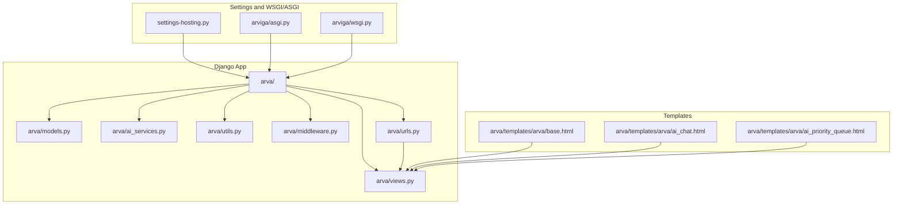
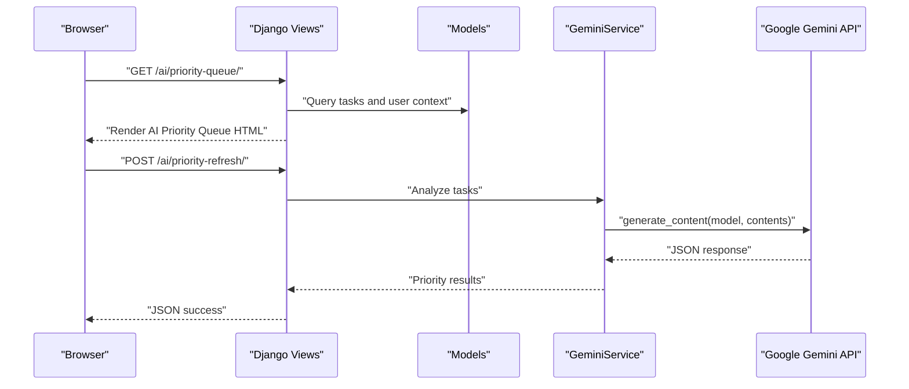
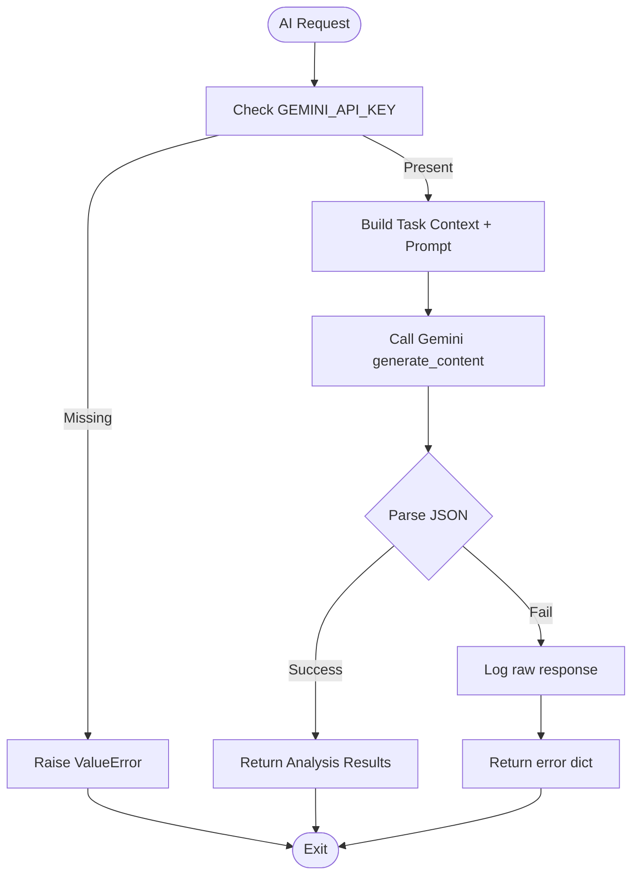
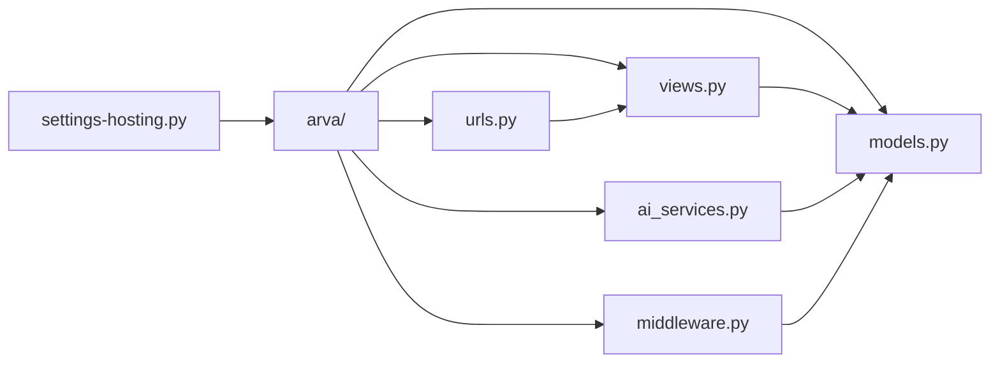

# Troubleshooting and FAQ

<cite>
**Referenced Files in This Document**
- [README.txt](file://README.txt)
- [SETUP_GUIDE.md](file://SETUP_GUIDE.md)
- [manage.py](file://manage.py)
- [settings-hosting.py](file://settings-hosting.py)
- [arva/models.py](file://arva/models.py)
- [arva/views.py](file://arva/views.py)
- [arva/ai_services.py](file://arva/ai_services.py)
- [arva/utils.py](file://arva/utils.py)
- [arva/middleware.py](file://arva/middleware.py)
- [arva/urls.py](file://arva/urls.py)
- [arviga/asgi.py](file://arviga/asgi.py)
- [arviga/wsgi.py](file://arviga/wsgi.py)
- [arva/templates/arva/base.html](file://arva/templates/arva/base.html)
- [arva/templates/arva/ai_chat.html](file://arva/templates/arva/ai_chat.html)
- [arva/templates/arva/ai_priority_queue.html](file://arva/templates/arva/ai_priority_queue.html)
</cite>

## Table of Contents
1. [Introduction](#introduction)
2. [Project Structure](#project-structure)
3. [Core Components](#core-components)
4. [Architecture Overview](#architecture-overview)
5. [Detailed Component Analysis](#detailed-component-analysis)
6. [Dependency Analysis](#dependency-analysis)
7. [Performance Considerations](#performance-considerations)
8. [Troubleshooting Guide](#troubleshooting-guide)
9. [Conclusion](#conclusion)
10. [Appendices](#appendices)

## Introduction
This document provides comprehensive troubleshooting guidance for Arva Kanban, focusing on database migration issues, AI service configuration, performance bottlenecks, browser compatibility, and authentication failures. It also covers debugging techniques for Django applications, JavaScript troubleshooting, database connectivity, and frequently asked questions around setup, user management, task workflows, and AI integration.

## Project Structure
Arva Kanban is a Django-based web application with a Kanban-style task board, user management, activity logging, and AI-powered features. The project follows a standard Django layout with apps, templates, static assets, and settings modules.

**Diagram sources**
- [arva/models.py](file://arva/models.py#L1-L445)
- [arva/views.py](file://arva/views.py#L1-L800)
- [arva/ai_services.py](file://arva/ai_services.py#L1-L326)
- [arva/utils.py](file://arva/utils.py#L1-L29)
- [arva/middleware.py](file://arva/middleware.py#L1-L39)
- [arva/urls.py](file://arva/urls.py#L1-L98)
- [settings-hosting.py](file://settings-hosting.py#L1-L133)
- [arviga/asgi.py](file://arviga/asgi.py#L1-L6)
- [arviga/wsgi.py](file://arviga/wsgi.py#L1-L6)
- [arva/templates/arva/base.html](file://arva/templates/arva/base.html#L1-L362)
- [arva/templates/arva/ai_chat.html](file://arva/templates/arva/ai_chat.html#L1-L912)
- [arva/templates/arva/ai_priority_queue.html](file://arva/templates/arva/ai_priority_queue.html#L1-L804)

**Section sources**
- [README.txt](file://README.txt#L1-L35)
- [SETUP_GUIDE.md](file://SETUP_GUIDE.md#L1-L95)
- [arva/urls.py](file://arva/urls.py#L1-L98)
- [arva/models.py](file://arva/models.py#L1-L445)

## Core Components
- Django settings and deployment: The hosting settings module defines database configuration, authentication backends, email backend, and static/media roots.
- Models: Define core entities including projects, tasks, comments, attachments, checklists, activity logs, and AI chat messages.
- Views: Handle routing, permissions, AJAX endpoints, and AI integrations.
- AI Services: Provide Gemini-based priority analysis and chat assistant.
- Middleware: Track user activity and enforce maintenance mode.
- Templates: Frontend rendering for base layout, AI chat, and priority queue.

**Section sources**
- [settings-hosting.py](file://settings-hosting.py#L60-L133)
- [arva/models.py](file://arva/models.py#L15-L445)
- [arva/views.py](file://arva/views.py#L1-L800)
- [arva/ai_services.py](file://arva/ai_services.py#L1-L326)
- [arva/middleware.py](file://arva/middleware.py#L1-L39)
- [arva/templates/arva/base.html](file://arva/templates/arva/base.html#L1-L362)

## Architecture Overview
The application uses Django’s WSGI/ASGI entry points, routes via URL patterns, and renders templates with dynamic data. AI features integrate with Google Gemini APIs through dedicated services.

**Diagram sources**
- [arva/urls.py](file://arva/urls.py#L86-L96)
- [arva/views.py](file://arva/views.py#L1-L800)
- [arva/ai_services.py](file://arva/ai_services.py#L115-L165)

## Detailed Component Analysis

### Database Connectivity and Migrations
Common issues:
- MySQL not running or port not listening.
- Duplicate column errors during migrations.
- Switching to SQLite for local development.

Resolution steps:
- Verify MySQL service is running and port 3306 is listening.
- Test connection with a Python script using the configured credentials.
- If encountering duplicate column errors, fake the problematic migration.
- For rapid local development, create a local settings override to use SQLite.

Diagnostic commands and checks:
- Use netstat to verify port 3306.
- Manually test connection with a Python MySQL client.
- Apply migrations and check status.
- If stuck on a specific migration, fake it.

**Section sources**
- [SETUP_GUIDE.md](file://SETUP_GUIDE.md#L42-L67)
- [settings-hosting.py](file://settings-hosting.py#L60-L70)

### AI Service Configuration (Google Gemini)
Common issues:
- Missing GEMINI_API_KEY environment variable.
- API quota limits or rate limiting.
- Parsing errors in AI responses.

Resolution steps:
- Set GEMINI_API_KEY in environment or Django settings.
- Ensure the latest model name is used and compatible with quotas.
- Handle JSON parsing errors gracefully and log raw responses for debugging.

**Diagram sources**
- [arva/ai_services.py](file://arva/ai_services.py#L14-L153)

**Section sources**
- [arva/ai_services.py](file://arva/ai_services.py#L1-L326)
- [arva/views.py](file://arva/views.py#L1-L800)

### Authentication Failures and Google OAuth
Common issues:
- Incorrect SOCIALACCOUNT provider configuration.
- Missing or invalid client credentials.
- Session and CSRF mismatch in AJAX requests.

Resolution steps:
- Confirm provider settings and keys in settings.
- Ensure ALLOWED_HOSTS includes your domain(s).
- Verify CSRF token handling in AJAX calls.
- Check maintenance mode middleware does not block non-superusers.

**Section sources**
- [settings-hosting.py](file://settings-hosting.py#L86-L98)
- [settings-hosting.py](file://settings-hosting.py#L9-L10)
- [arva/middleware.py](file://arva/middleware.py#L24-L39)
- [arva/templates/arva/base.html](file://arva/templates/arva/base.html#L760-L780)

### Performance Bottlenecks and Memory Usage
Common issues:
- Excessive database queries in views.
- Large template rendering with many prefetches.
- Background email sending overhead.

Optimization techniques:
- Use select_related and prefetch_related judiciously.
- Paginate heavy lists and limit query sizes.
- Offload email sending to threaded background tasks.
- Monitor maintenance mode impact on user experience.

**Section sources**
- [arva/views.py](file://arva/views.py#L420-L800)
- [arva/utils.py](file://arva/utils.py#L1-L29)
- [arva/middleware.py](file://arva/middleware.py#L1-L39)

### Browser Compatibility Problems
Common issues:
- jQuery UI drag-and-drop not working.
- Bootstrap and SweetAlert2 conflicts.
- Theme and layout rendering differences.

Resolution steps:
- Ensure jQuery and jQuery UI versions match those included in static assets.
- Verify Bootstrap and SweetAlert2 are loaded after jQuery.
- Test themes and layouts across browsers; adjust CSS variables if needed.

**Section sources**
- [arva/templates/arva/base.html](file://arva/templates/arva/base.html#L13-L362)
- [arva/templates/arva/ai_chat.html](file://arva/templates/arva/ai_chat.html#L532-L784)
- [arva/templates/arva/ai_priority_queue.html](file://arva/templates/arva/ai_priority_queue.html#L450-L804)

### User Management and Permissions
Common issues:
- Superuser creation and password reset.
- Role-based UI branching (deprecated).
- Project visibility and membership.

Resolution steps:
- Use createsuperuser to bootstrap admin accounts.
- Admins can toggle user activity and reset passwords.
- Project access is determined by project membership and ownership.

**Section sources**
- [README.txt](file://README.txt#L28-L32)
- [SETUP_GUIDE.md](file://SETUP_GUIDE.md#L19-L23)
- [arva/views.py](file://arva/views.py#L190-L380)
- [arva/models.py](file://arva/models.py#L101-L178)

### Task Workflows and Activity Logs
Common issues:
- Task movement and archiving not reflected.
- Checklist and comment counts incorrect.
- Overdue/due indicators not updating.

Resolution steps:
- Ensure AJAX endpoints for task updates are called and validated.
- Verify activity log entries are created on state changes.
- Check template rendering for overdue indicators and checklist progress.

**Section sources**
- [arva/views.py](file://arva/views.py#L466-L800)
- [arva/models.py](file://arva/models.py#L387-L445)

## Dependency Analysis
Key dependencies and relationships:
- Django settings define database, authentication, and static/media roots.
- URL patterns route to views that use models and AI services.
- Middleware affects request lifecycle and user sessions.
- Templates depend on static assets and context processors.

**Diagram sources**
- [settings-hosting.py](file://settings-hosting.py#L1-L133)
- [arva/models.py](file://arva/models.py#L1-L445)
- [arva/views.py](file://arva/views.py#L1-L800)
- [arva/ai_services.py](file://arva/ai_services.py#L1-L326)
- [arva/middleware.py](file://arva/middleware.py#L1-L39)
- [arva/urls.py](file://arva/urls.py#L1-L98)

**Section sources**
- [settings-hosting.py](file://settings-hosting.py#L1-L133)
- [arva/urls.py](file://arva/urls.py#L1-L98)

## Performance Considerations
- Optimize queries with select_related and prefetch_related to reduce N+1 issues.
- Limit AI analysis batch sizes and cache results where appropriate.
- Minimize DOM updates in JavaScript-heavy templates.
- Use pagination for long lists and avoid loading excessive data at once.

[No sources needed since this section provides general guidance]

## Troubleshooting Guide

### Database Migration Problems
Symptoms:
- Migration fails with duplicate column errors.
- Database not reachable.

Steps:
- Confirm MySQL is running and port 3306 is listening.
- Test connection with the configured credentials.
- Fake the problematic migration if necessary.
- Optionally switch to SQLite for local development by adding a local settings override.

**Section sources**
- [SETUP_GUIDE.md](file://SETUP_GUIDE.md#L42-L67)
- [settings-hosting.py](file://settings-hosting.py#L60-L70)

### AI Service Configuration Issues
Symptoms:
- AI endpoints return errors or empty results.
- JSON parsing failures.

Steps:
- Set GEMINI_API_KEY in environment or Django settings.
- Validate model name compatibility and quotas.
- Inspect raw AI responses for debugging.

**Section sources**
- [arva/ai_services.py](file://arva/ai_services.py#L14-L153)

### Performance Bottlenecks
Symptoms:
- Slow page loads, especially on boards with many tasks.
- High memory usage during AI analysis.

Steps:
- Review views for unnecessary queries and optimize with select_related/prefetch_related.
- Reduce batch sizes for AI analysis and cache results.
- Offload email sending to background threads.

**Section sources**
- [arva/views.py](file://arva/views.py#L420-L800)
- [arva/utils.py](file://arva/utils.py#L1-L29)

### Browser Compatibility Problems
Symptoms:
- Drag-and-drop not working.
- Styles inconsistent across browsers.

Steps:
- Ensure jQuery and jQuery UI versions match static assets.
- Load Bootstrap and SweetAlert2 after jQuery.
- Test across browsers and adjust CSS variables if needed.

**Section sources**
- [arva/templates/arva/base.html](file://arva/templates/arva/base.html#L13-L362)
- [arva/templates/arva/ai_chat.html](file://arva/templates/arva/ai_chat.html#L532-L784)
- [arva/templates/arva/ai_priority_queue.html](file://arva/templates/arva/ai_priority_queue.html#L450-L804)

### Authentication Failures
Symptoms:
- Login redirects loop or fails.
- Google OAuth errors.

Steps:
- Verify provider credentials and scopes.
- Ensure ALLOWED_HOSTS includes your domains.
- Confirm CSRF tokens are present in AJAX requests.
- Check maintenance mode does not block non-superusers.

**Section sources**
- [settings-hosting.py](file://settings-hosting.py#L86-L98)
- [settings-hosting.py](file://settings-hosting.py#L9-L10)
- [arva/middleware.py](file://arva/middleware.py#L24-L39)
- [arva/templates/arva/base.html](file://arva/templates/arva/base.html#L760-L780)

### Debugging Techniques
Django:
- Use Django shell to inspect models and relationships.
- Enable DEBUG temporarily for detailed error pages.
- Check logs for unhandled exceptions.

JavaScript:
- Open browser dev tools and network tab to inspect AJAX calls.
- Verify CSRF token presence and correctness.
- Check console for JavaScript errors.

Database:
- Use database client to run EXPLAIN plans for slow queries.
- Confirm indexes exist on frequently filtered fields.

**Section sources**
- [manage.py](file://manage.py#L1-L12)
- [arva/templates/arva/base.html](file://arva/templates/arva/base.html#L760-L780)

### Frequently Asked Questions

Q: How do I run the application locally?
A: Install dependencies, configure the database, run migrations, create a superuser, and start the development server.

Q: How do I switch to SQLite for development?
A: Create a local settings override to use sqlite3.

Q: Why am I getting AI analysis errors?
A: Ensure GEMINI_API_KEY is set and the model is accessible.

Q: How do I reset a user’s password?
A: Use the admin interface to reset passwords.

Q: How do I enable maintenance mode?
A: Toggle the maintenance flag in website settings.

Q: How do I troubleshoot drag-and-drop issues?
A: Verify jQuery UI and Bootstrap versions match static assets.

Q: How do I fix CSRF errors in AJAX?
A: Ensure CSRF token is included in AJAX headers.

Q: How do I diagnose slow page loads?
A: Use Django debug toolbar, inspect queries, and optimize with select_related/prefetch_related.

**Section sources**
- [README.txt](file://README.txt#L16-L32)
- [SETUP_GUIDE.md](file://SETUP_GUIDE.md#L57-L67)
- [arva/ai_services.py](file://arva/ai_services.py#L14-L21)
- [arva/views.py](file://arva/views.py#L333-L348)
- [arva/models.py](file://arva/models.py#L35-L43)
- [arva/templates/arva/base.html](file://arva/templates/arva/base.html#L13-L362)
- [arva/templates/arva/base.html](file://arva/templates/arva/base.html#L760-L780)

## Conclusion
By following the troubleshooting steps and best practices outlined here, most common issues with Arva Kanban can be quickly diagnosed and resolved. Focus on database connectivity, AI service configuration, authentication, and performance optimization to maintain a smooth-running application.

[No sources needed since this section summarizes without analyzing specific files]

## Appendices

### Diagnostic Commands and Tools
- Check MySQL port: netstat -ano | findstr ":3306"
- Test MySQL connection: Python script with configured credentials
- Run migrations: python manage.py migrate
- Create superuser: python manage.py createsuperuser
- Start server: python manage.py runserver
- Install dependencies: pip install -r requirements.txt

**Section sources**
- [SETUP_GUIDE.md](file://SETUP_GUIDE.md#L69-L83)