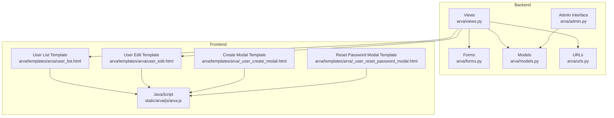
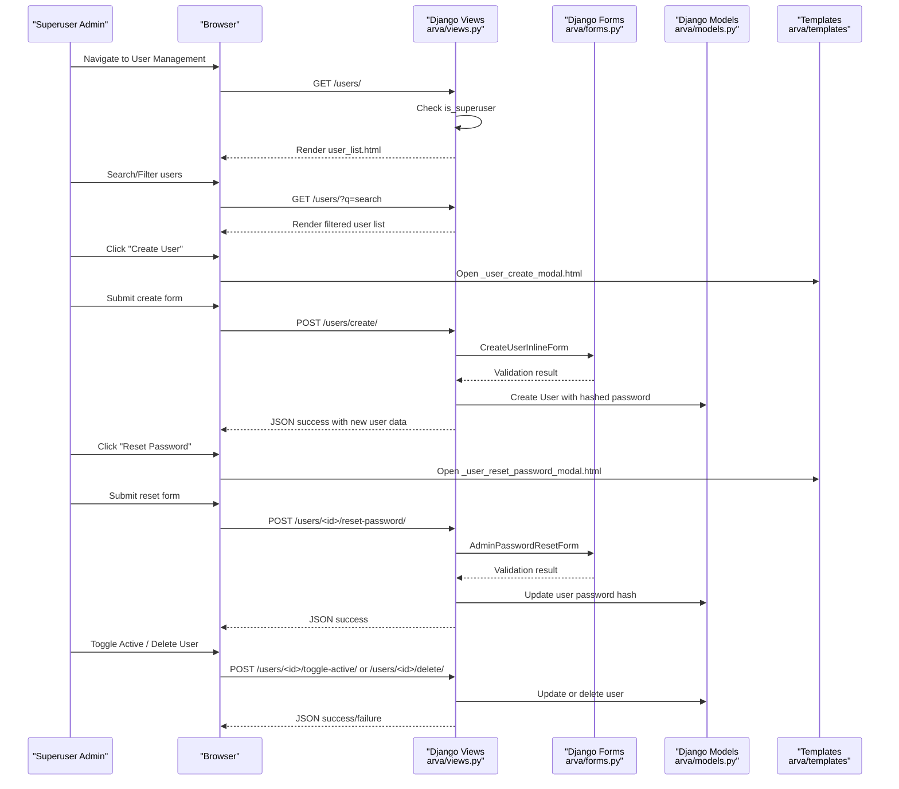
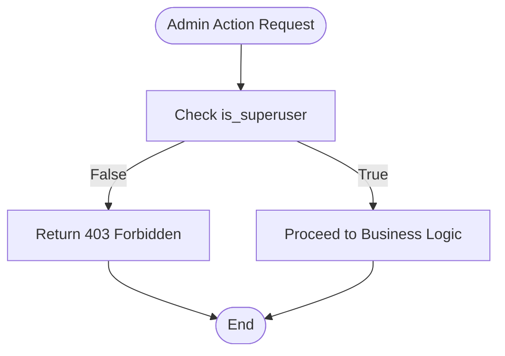
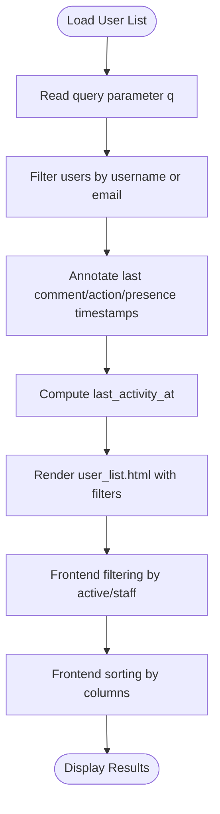
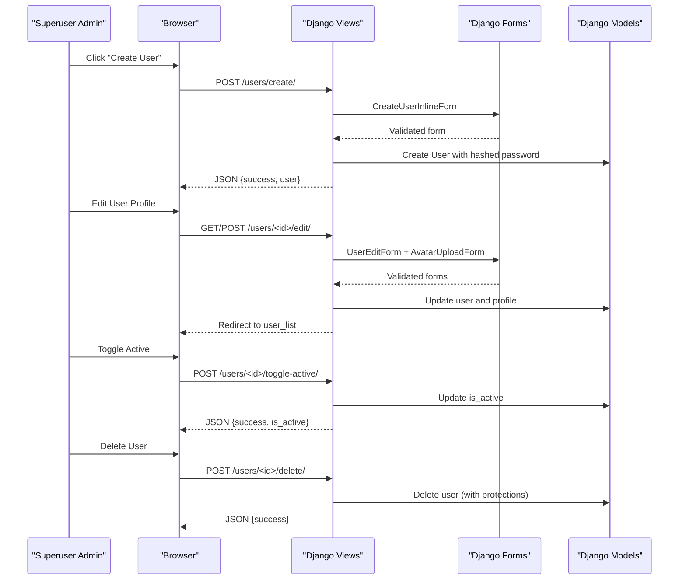
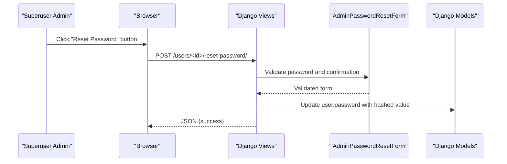
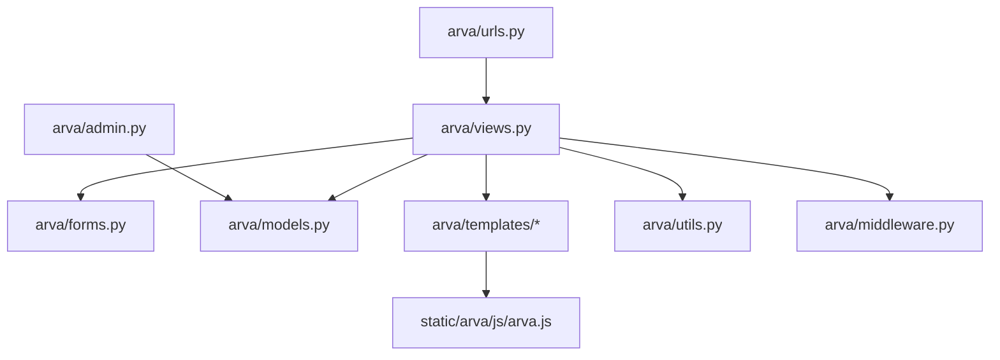

# Administrative User Management

<cite>
**Referenced Files in This Document**
- [arva/views.py](file://arva/views.py)
- [arva/models.py](file://arva/models.py)
- [arva/forms.py](file://arva/forms.py)
- [arva/urls.py](file://arva/urls.py)
- [arva/admin.py](file://arva/admin.py)
- [arva/templates/arva/user_list.html](file://arva/templates/arva/user_list.html)
- [arva/templates/arva/user_edit.html](file://arva/templates/arva/user_edit.html)
- [arva/templates/arva/_user_create_modal.html](file://arva/templates/arva/_user_create_modal.html)
- [arva/templates/arva/_user_reset_password_modal.html](file://arva/templates/arva/_user_reset_password_modal.html)
- [arva/templates/arva/activity_log.html](file://arva/templates/arva/activity_log.html)
- [arva/templates/arva/base.html](file://arva/templates/arva/base.html)
- [arva/utils.py](file://arva/utils.py)
- [arva/middleware.py](file://arva/middleware.py)
- [static/arva/js/arva.js](file://static/arva/js/arva.js)
</cite>

## Table of Contents
1. [Introduction](#introduction)
2. [Project Structure](#project-structure)
3. [Core Components](#core-components)
4. [Architecture Overview](#architecture-overview)
5. [Detailed Component Analysis](#detailed-component-analysis)
6. [Dependency Analysis](#dependency-analysis)
7. [Performance Considerations](#performance-considerations)
8. [Troubleshooting Guide](#troubleshooting-guide)
9. [Conclusion](#conclusion)

## Introduction
This document provides comprehensive documentation for administrative user management capabilities in Arva Kanban. It explains the superuser functionality, user listing and management interfaces, administrative controls, and permission enforcement mechanisms. The documentation covers administrative views, bulk user operations, user activation/deactivation, password reset procedures, role management, audit trails, and common administrative scenarios such as user onboarding assistance, account recovery, and handling user complaints.

## Project Structure
The administrative user management system spans several key areas:
- Backend views and permissions enforcing superuser-only access
- User listing interface with filtering and search
- User creation, editing, activation toggling, password reset, and deletion
- Frontend JavaScript handling user management interactions
- Templates implementing user management UI
- Forms validating user-related operations
- Models supporting user profiles and activity tracking

**Diagram sources**
- [arva/views.py](file://arva/views.py#L218-L367)
- [arva/forms.py](file://arva/forms.py#L67-L127)
- [arva/models.py](file://arva/models.py#L56-L100)
- [arva/urls.py](file://arva/urls.py#L70-L79)
- [arva/admin.py](file://arva/admin.py#L1-L50)
- [arva/templates/arva/user_list.html](file://arva/templates/arva/user_list.html#L1-L265)
- [arva/templates/arva/user_edit.html](file://arva/templates/arva/user_edit.html#L1-L155)
- [arva/templates/arva/_user_create_modal.html](file://arva/templates/arva/_user_create_modal.html#L1-L33)
- [arva/templates/arva/_user_reset_password_modal.html](file://arva/templates/arva/_user_reset_password_modal.html#L1-L29)
- [static/arva/js/arva.js](file://static/arva/js/arva.js#L599-L700)

**Section sources**
- [arva/views.py](file://arva/views.py#L218-L367)
- [arva/urls.py](file://arva/urls.py#L70-L79)
- [arva/templates/arva/user_list.html](file://arva/templates/arva/user_list.html#L1-L265)

## Core Components
This section outlines the core components involved in administrative user management:

- Superuser-only endpoints: user listing, user creation, user edit, toggle active, reset password, hard delete, and project member role updates/removal.
- User listing interface with search by username/email and filtering by active status and staff status.
- User creation via inline modal with form validation.
- User edit interface allowing updates to personal info, avatar/icon, and project memberships.
- Password reset controlled by administrative form validation.
- Activity logging and audit trail for administrative actions.
- Frontend JavaScript handling filtering, sorting, modals, and AJAX interactions.

Key implementation references:
- User listing view and filtering: [arva/views.py](file://arva/views.py#L218-L245)
- User creation endpoint: [arva/views.py](file://arva/views.py#L247-L268)
- User edit view: [arva/views.py](file://arva/views.py#L271-L316)
- Toggle active: [arva/views.py](file://arva/views.py#L318-L331)
- Reset password: [arva/views.py](file://arva/views.py#L333-L348)
- Hard delete: [arva/views.py](file://arva/views.py#L350-L366)
- Project member role update/remove: [arva/views.py](file://arva/views.py#L370-L391)
- User creation form: [arva/forms.py](file://arva/forms.py#L67-L85)
- Admin password reset form: [arva/forms.py](file://arva/forms.py#L110-L127)
- User list template: [arva/templates/arva/user_list.html](file://arva/templates/arva/user_list.html#L1-L265)
- User edit template: [arva/templates/arva/user_edit.html](file://arva/templates/arva/user_edit.html#L1-L155)
- Create user modal: [arva/templates/arva/_user_create_modal.html](file://arva/templates/arva/_user_create_modal.html#L1-L33)
- Reset password modal: [arva/templates/arva/_user_reset_password_modal.html](file://arva/templates/arva/_user_reset_password_modal.html#L1-L29)
- Activity log template: [arva/templates/arva/activity_log.html](file://arva/templates/arva/activity_log.html#L1-L102)

**Section sources**
- [arva/views.py](file://arva/views.py#L218-L391)
- [arva/forms.py](file://arva/forms.py#L67-L127)
- [arva/templates/arva/user_list.html](file://arva/templates/arva/user_list.html#L1-L265)
- [arva/templates/arva/user_edit.html](file://arva/templates/arva/user_edit.html#L1-L155)
- [arva/templates/arva/_user_create_modal.html](file://arva/templates/arva/_user_create_modal.html#L1-L33)
- [arva/templates/arva/_user_reset_password_modal.html](file://arva/templates/arva/_user_reset_password_modal.html#L1-L29)
- [arva/templates/arva/activity_log.html](file://arva/templates/arva/activity_log.html#L1-L102)

## Architecture Overview
The administrative user management architecture enforces strict permission checks at the view level, ensuring only superusers can perform administrative actions. The frontend provides interactive filtering, sorting, and modal-driven operations that communicate with backend endpoints via AJAX.

**Diagram sources**
- [arva/views.py](file://arva/views.py#L218-L367)
- [arva/forms.py](file://arva/forms.py#L67-L127)
- [arva/models.py](file://arva/models.py#L56-L100)
- [arva/templates/arva/user_list.html](file://arva/templates/arva/user_list.html#L1-L265)
- [arva/templates/arva/_user_create_modal.html](file://arva/templates/arva/_user_create_modal.html#L1-L33)
- [arva/templates/arva/_user_reset_password_modal.html](file://arva/templates/arva/_user_reset_password_modal.html#L1-L29)

## Detailed Component Analysis

### Superuser Permission Enforcement
Superuser-only access is enforced across all administrative endpoints. Attempts to access these endpoints without superuser privileges result in forbidden responses or redirects.

Key enforcement points:
- User listing requires superuser: [arva/views.py](file://arva/views.py#L219-L222)
- User creation requires superuser: [arva/views.py](file://arva/views.py#L249-L251)
- User edit requires superuser: [arva/views.py](file://arva/views.py#L272-L274)
- Toggle active requires superuser: [arva/views.py](file://arva/views.py#L321-L322)
- Reset password requires superuser: [arva/views.py](file://arva/views.py#L336-L337)
- Hard delete requires superuser and protection against self-deletion and deleting other superusers: [arva/views.py](file://arva/views.py#L353-L362)
- Project member role update/remove requires superuser: [arva/views.py](file://arva/views.py#L372-L373)

**Diagram sources**
- [arva/views.py](file://arva/views.py#L219-L222)
- [arva/views.py](file://arva/views.py#L249-L251)
- [arva/views.py](file://arva/views.py#L321-L322)
- [arva/views.py](file://arva/views.py#L336-L337)
- [arva/views.py](file://arva/views.py#L353-L362)
- [arva/views.py](file://arva/views.py#L372-L373)

**Section sources**
- [arva/views.py](file://arva/views.py#L219-L373)

### User Listing Interface with Filtering and Search
The user listing interface provides comprehensive filtering and search capabilities:
- Search by username or email using query parameter q
- Filter by active status (active/inactive)
- Filter by staff status (staff/non-staff)
- Sortable columns: user, email, active, staff, last activity, last login, joined, status
- Dual view modes: table view and card view with persistent view preferences

Implementation highlights:
- Query construction and filtering: [arva/views.py](file://arva/views.py#L224-L234)
- Annotation of last activity timestamps: [arva/views.py](file://arva/views.py#L225-L240)
- Frontend filtering logic: [static/arva/js/arva.js](file://static/arva/js/arva.js#L613-L639)
- Sorting implementation: [static/arva/js/arva.js](file://static/arva/js/arva.js#L651-L689)
- Template rendering with filter controls: [arva/templates/arva/user_list.html](file://arva/templates/arva/user_list.html#L38-L56)

**Diagram sources**
- [arva/views.py](file://arva/views.py#L224-L240)
- [arva/templates/arva/user_list.html](file://arva/templates/arva/user_list.html#L38-L56)
- [static/arva/js/arva.js](file://static/arva/js/arva.js#L613-L689)

**Section sources**
- [arva/views.py](file://arva/views.py#L218-L245)
- [arva/templates/arva/user_list.html](file://arva/templates/arva/user_list.html#L1-L265)
- [static/arva/js/arva.js](file://static/arva/js/arva.js#L599-L692)

### User Creation, Editing, and Deletion
Administrators can create new users, edit existing user profiles, toggle user activity, reset passwords, and delete users.

User creation:
- Endpoint: POST /users/create/
- Form validation ensures unique username and email
- Password is hashed before saving
- Returns JSON with new user details

User editing:
- Endpoint: GET/POST /users/<int:user_id>/edit/
- Allows updating username, email, active status, staff status, and avatar/icon
- Shows project memberships and last seen activity

User activation toggle:
- Endpoint: POST /users/<int:user_id>/toggle-active/
- Switches is_active flag and returns new status

Hard delete:
- Endpoint: POST /users/<int:user_id>/delete/
- Prevents self-deletion and deletion of other superusers
- Returns success on deletion

**Diagram sources**
- [arva/views.py](file://arva/views.py#L247-L366)
- [arva/forms.py](file://arva/forms.py#L67-L109)
- [arva/templates/arva/user_edit.html](file://arva/templates/arva/user_edit.html#L36-L79)

**Section sources**
- [arva/views.py](file://arva/views.py#L247-L366)
- [arva/forms.py](file://arva/forms.py#L67-L109)
- [arva/templates/arva/user_edit.html](file://arva/templates/arva/user_edit.html#L1-L155)

### Password Reset Administration
Administrators can reset user passwords through a dedicated modal and endpoint:
- Endpoint: POST /users/<int:user_id>/reset-password/
- Uses AdminPasswordResetForm for validation (password confirmation)
- Hashes and saves the new password
- Returns success response

**Diagram sources**
- [arva/views.py](file://arva/views.py#L333-L348)
- [arva/forms.py](file://arva/forms.py#L110-L127)

**Section sources**
- [arva/views.py](file://arva/views.py#L333-L348)
- [arva/forms.py](file://arva/forms.py#L110-L127)

### Project Member Role Management
Although role-based access control has been deprecated, administrative users can still manage project memberships:
- Update role: POST /project-member/<int:pm_id>/update-role/ (role forced to member)
- Remove membership: POST /project-member/<int:pm_id>/remove/

These endpoints enforce superuser-only access and maintain backward compatibility for membership management.

**Section sources**
- [arva/views.py](file://arva/views.py#L370-L391)

### Audit Trail and Activity Logging
Administrative actions are logged through the ActivityLog model and can be viewed in the activity log interface:
- ActivityLog tracks actions performed by users
- Filtering supports search, action type, user, and date range
- Pagination for large activity sets

Integration points:
- ActivityLog model definition: [arva/models.py](file://arva/models.py#L387-L421)
- Activity log view and filtering: [arva/views.py](file://arva/views.py#L904-L971)
- Activity log template: [arva/templates/arva/activity_log.html](file://arva/templates/arva/activity_log.html#L1-L102)

**Section sources**
- [arva/models.py](file://arva/models.py#L387-L421)
- [arva/views.py](file://arva/views.py#L904-L971)
- [arva/templates/arva/activity_log.html](file://arva/templates/arva/activity_log.html#L1-L102)

### Frontend Interactions and User Experience
The frontend JavaScript provides:
- Persistent view preferences for user list (table/card)
- Real-time filtering and sorting of user lists
- Modal dialogs for user creation and password reset
- Confirmation dialogs for destructive actions
- AJAX interactions for non-reload operations

Key frontend features:
- User list initialization and filtering: [static/arva/js/arva.js](file://static/arva/js/arva.js#L599-L692)
- Modal triggers and handlers: [static/arva/js/arva.js](file://static/arva/js/arva.js#L2201-L2264)
- Confirmation dialogs: [static/arva/js/arva.js](file://static/arva/js/arva.js#L67-L76)

**Section sources**
- [static/arva/js/arva.js](file://static/arva/js/arva.js#L599-L700)
- [static/arva/js/arva.js](file://static/arva/js/arva.js#L2201-L2264)

## Dependency Analysis
The administrative user management system exhibits clear separation of concerns:
- Views depend on Forms for validation and Models for persistence
- Templates depend on Views for data and JavaScript for interactivity
- URLs route requests to appropriate Views
- Admin interface integrates with Django admin for model management

**Diagram sources**
- [arva/views.py](file://arva/views.py#L1-L50)
- [arva/forms.py](file://arva/forms.py#L1-L30)
- [arva/models.py](file://arva/models.py#L1-L50)
- [arva/urls.py](file://arva/urls.py#L1-L20)
- [arva/admin.py](file://arva/admin.py#L1-L50)
- [arva/utils.py](file://arva/utils.py#L1-L50)
- [arva/middleware.py](file://arva/middleware.py#L1-L50)

**Section sources**
- [arva/views.py](file://arva/views.py#L1-L50)
- [arva/urls.py](file://arva/urls.py#L1-L20)
- [arva/admin.py](file://arva/admin.py#L1-L50)

## Performance Considerations
- Efficient database queries: The user listing view uses select_related and annotate to minimize database hits and compute last activity efficiently.
- Pagination: While the user listing view does not currently paginate, the activity log demonstrates proper pagination patterns that could be applied to user listings for large datasets.
- Frontend filtering: Client-side filtering reduces server load for basic searches and filters.
- Minimal data transfer: Endpoints return JSON responses for AJAX operations, reducing page reload overhead.

## Troubleshooting Guide
Common administrative scenarios and their handling:

- Access Denied: If a non-superuser attempts administrative actions, they receive 403 Forbidden responses or redirects to project list with error messages.
  - Reference: [arva/views.py](file://arva/views.py#L220-L222), [arva/views.py](file://arva/views.py#L249-L251), [arva/views.py](file://arva/views.py#L321-L322), [arva/views.py](file://arva/views.py#L336-L337), [arva/views.py](file://arva/views.py#L353-L362), [arva/views.py](file://arva/views.py#L372-L373)

- Duplicate Username/Email: User creation and editing forms validate uniqueness and return specific error messages for duplicates.
  - Reference: [arva/forms.py](file://arva/forms.py#L74-L84), [arva/forms.py](file://arva/forms.py#L95-L108)

- Password Mismatch: Admin password reset form validates confirmation and returns validation errors.
  - Reference: [arva/forms.py](file://arva/forms.py#L120-L126)

- Self-Deletion Protection: Attempting to delete oneself or another superuser results in immediate failure.
  - Reference: [arva/views.py](file://arva/views.py#L358-L362)

- Sub-project Deletion Constraints: Related to project member management, sub-project deletion prevents removal if tasks exist.
  - Reference: [arva/views.py](file://arva/views.py#L574-L575)

**Section sources**
- [arva/views.py](file://arva/views.py#L220-L362)
- [arva/forms.py](file://arva/forms.py#L74-L126)

## Conclusion
Arva Kanban's administrative user management system provides robust superuser-only controls for user lifecycle management, including creation, editing, activation toggling, password resets, and deletion. The system combines Django's permission enforcement with a responsive frontend interface offering real-time filtering, sorting, and modal-driven operations. Activity logging ensures transparency and auditability of administrative actions. The architecture supports scalability through efficient database queries and client-side optimizations, while maintaining strong security boundaries around sensitive administrative operations.