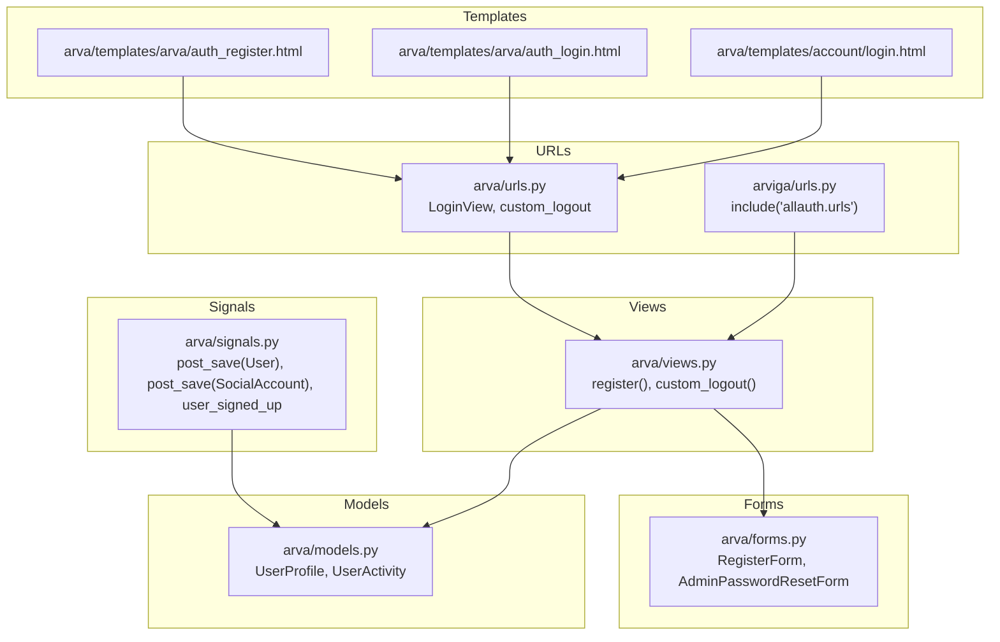
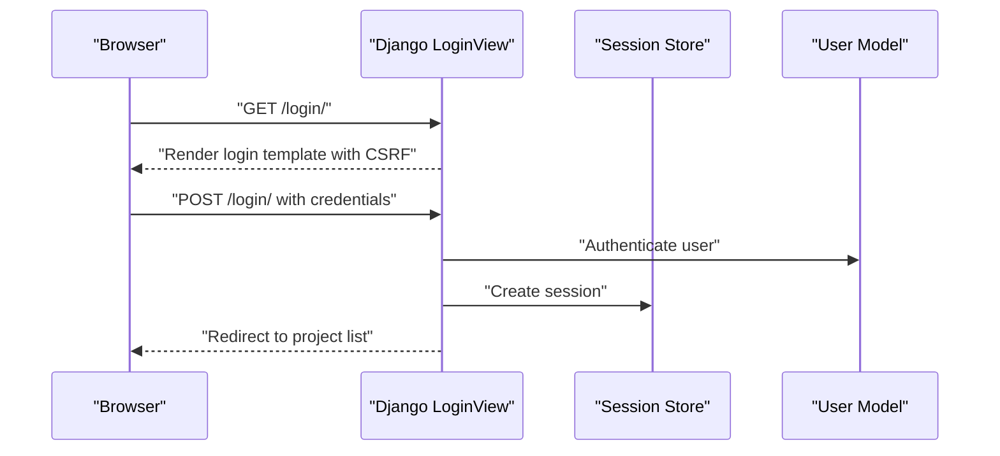
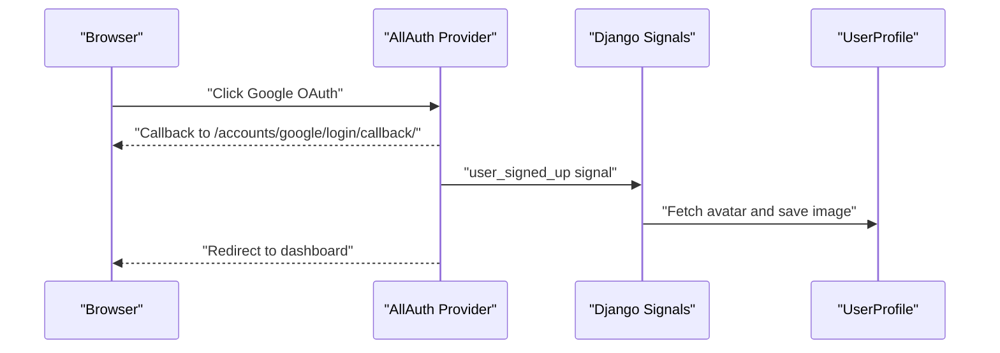
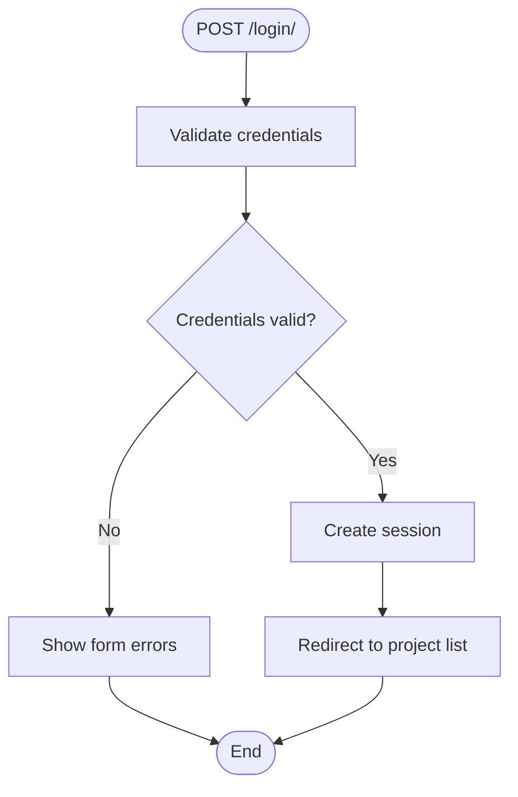
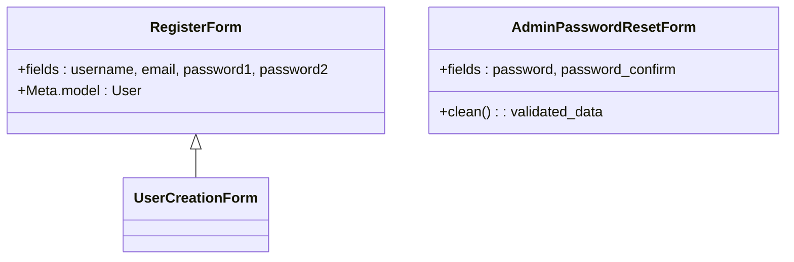
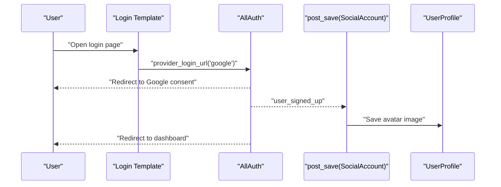
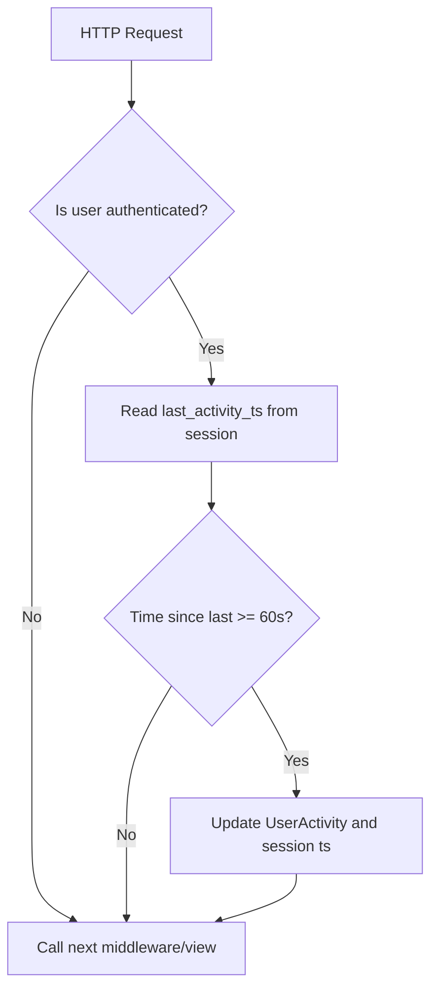
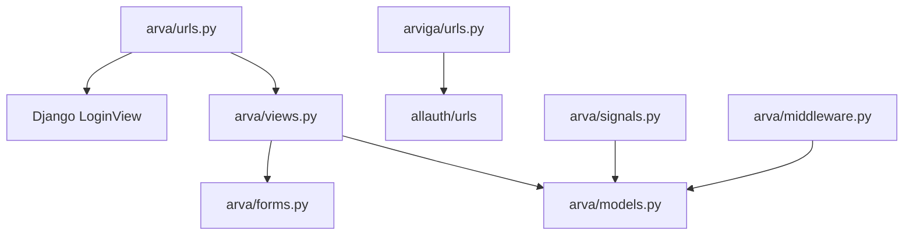

# Authentication Systems

<cite>
**Referenced Files in This Document**
- [arva/views.py](file://arva/views.py)
- [arva/forms.py](file://arva/forms.py)
- [arva/models.py](file://arva/models.py)
- [arva/middleware.py](file://arva/middleware.py)
- [arva/signals.py](file://arva/signals.py)
- [arva/utils.py](file://arva/utils.py)
- [arva/urls.py](file://arva/urls.py)
- [arviga/urls.py](file://arviga/urls.py)
- [arva/templates/account/login.html](file://arva/templates/account/login.html)
- [arva/templates/arva/auth_login.html](file://arva/templates/arva/auth_login.html)
- [arva/templates/arva/auth_register.html](file://arva/templates/arva/auth_register.html)
- [arva/apps.py](file://arva/apps.py)
</cite>

## Table of Contents
1. [Introduction](#introduction)
2. [Project Structure](#project-structure)
3. [Core Components](#core-components)
4. [Architecture Overview](#architecture-overview)
5. [Detailed Component Analysis](#detailed-component-analysis)
6. [Dependency Analysis](#dependency-analysis)
7. [Performance Considerations](#performance-considerations)
8. [Troubleshooting Guide](#troubleshooting-guide)
9. [Conclusion](#conclusion)

## Introduction
This document explains the authentication systems in Arva Kanban, focusing on Django’s built-in authentication and Django AllAuth integration for Google OAuth. It covers user registration, login/logout, password management, session handling, CSRF protection, and security considerations. It also documents avatar fetching from Google OAuth, email verification processes, password reset functionality, and common scenarios such as first-time OAuth setup, account merging, and handling authentication failures.

## Project Structure
Authentication spans several modules:
- URL routing wires Django’s auth views and AllAuth URLs.
- Views implement custom logout and expose registration logic.
- Forms encapsulate validation for registration and admin password resets.
- Models define user profiles and preferences, including Google ID and avatar storage.
- Signals integrate with AllAuth to fetch avatars and send welcome emails.
- Middleware tracks user activity and enforces maintenance mode.
- Templates provide login and registration UIs, including Google OAuth buttons.

**Diagram sources**
- [arviga/urls.py](file://arviga/urls.py#L9-L9)
- [arva/urls.py](file://arva/urls.py#L7-L8)
- [arva/views.py](file://arva/views.py#L57-L82)
- [arva/forms.py](file://arva/forms.py#L128-L134)
- [arva/models.py](file://arva/models.py#L56-L99)
- [arva/signals.py](file://arva/signals.py#L14-L61)
- [arva/templates/account/login.html](file://arva/templates/account/login.html#L8-L10)
- [arva/templates/arva/auth_login.html](file://arva/templates/arva/auth_login.html#L68-L80)
- [arva/templates/arva/auth_register.html](file://arva/templates/arva/auth_register.html#L9-L12)

**Section sources**
- [arviga/urls.py](file://arviga/urls.py#L9-L9)
- [arva/urls.py](file://arva/urls.py#L7-L8)
- [arva/views.py](file://arva/views.py#L57-L82)
- [arva/forms.py](file://arva/forms.py#L128-L134)
- [arva/models.py](file://arva/models.py#L56-L99)
- [arva/signals.py](file://arva/signals.py#L14-L61)
- [arva/templates/account/login.html](file://arva/templates/account/login.html#L8-L10)
- [arva/templates/arva/auth_login.html](file://arva/templates/arva/auth_login.html#L68-L80)
- [arva/templates/arva/auth_register.html](file://arva/templates/arva/auth_register.html#L9-L12)

## Core Components
- Built-in Django authentication
  - Login view configured via Django’s LoginView with a custom template.
  - Logout view delegates to Django’s logout and clears AllAuth-specific session data.
  - Registration view uses a custom form and logs the user in upon successful creation.
- AllAuth integration
  - AllAuth URLs included globally; Google OAuth initiated via template links.
  - Signals handle avatar fetching and welcome email on first Google sign-up.
- Session and activity
  - Middleware updates user activity timestamps and persists to the database.
  - User profile stores theme/layout preferences and optional Google avatar.
- Security and CSRF
  - Templates include CSRF tokens in forms.
  - Login templates link to Google OAuth with a next parameter for safe redirects.

**Section sources**
- [arva/urls.py](file://arva/urls.py#L7-L8)
- [arva/views.py](file://arva/views.py#L57-L82)
- [arviga/urls.py](file://arviga/urls.py#L9-L9)
- [arva/signals.py](file://arva/signals.py#L19-L61)
- [arva/middleware.py](file://arva/middleware.py#L7-L22)
- [arva/models.py](file://arva/models.py#L56-L99)
- [arva/templates/account/login.html](file://arva/templates/account/login.html#L15-L15)
- [arva/templates/arva/auth_login.html](file://arva/templates/arva/auth_login.html#L40-L40)

## Architecture Overview
The authentication flow combines Django’s built-in views and AllAuth for external OAuth. The following sequence diagrams illustrate key flows.

**Diagram sources**
- [arva/urls.py](file://arva/urls.py#L7-L7)
- [arva/templates/arva/auth_login.html](file://arva/templates/arva/auth_login.html#L39-L64)

**Diagram sources**
- [arviga/urls.py](file://arviga/urls.py#L9-L9)
- [arva/signals.py](file://arva/signals.py#L19-L61)
- [arva/models.py](file://arva/models.py#L56-L99)

## Detailed Component Analysis

### Built-in Authentication Views
- Login
  - Uses Django’s LoginView with a custom template.
  - Template renders CSRF and supports a hidden redirect field for safe navigation after login.
- Logout
  - Delegates to Django’s logout and clears AllAuth-specific session data before redirecting to the login page.
- Registration
  - Accepts POST with validated form data, creates a user, and logs them in automatically.

**Diagram sources**
- [arva/urls.py](file://arva/urls.py#L7-L7)
- [arva/templates/arva/auth_login.html](file://arva/templates/arva/auth_login.html#L39-L64)

**Section sources**
- [arva/urls.py](file://arva/urls.py#L7-L8)
- [arva/views.py](file://arva/views.py#L57-L82)
- [arva/templates/arva/auth_login.html](file://arva/templates/arva/auth_login.html#L39-L64)
- [arva/templates/account/login.html](file://arva/templates/account/login.html#L15-L15)

### Registration Form Validation
- RegisterForm extends Django’s UserCreationForm and requires email.
- Validation ensures uniqueness of username and email during registration.
- Admin password reset form enforces confirmation equality.

**Diagram sources**
- [arva/forms.py](file://arva/forms.py#L128-L134)
- [arva/forms.py](file://arva/forms.py#L110-L126)

**Section sources**
- [arva/forms.py](file://arva/forms.py#L128-L134)
- [arva/forms.py](file://arva/forms.py#L110-L126)

### AllAuth Google OAuth Integration
- URL wiring
  - Global inclusion of AllAuth URLs enables OAuth flows under /accounts/.
- Template integration
  - Login templates provide “Continue with Google” links using AllAuth’s provider_login_url tag.
- Avatar and welcome email
  - On first Google sign-up, signals fetch the avatar from Google and save it to the user’s profile.
  - A welcome email is sent asynchronously.

**Diagram sources**
- [arviga/urls.py](file://arviga/urls.py#L9-L9)
- [arva/templates/account/login.html](file://arva/templates/account/login.html#L8-L10)
- [arva/templates/arva/auth_login.html](file://arva/templates/arva/auth_login.html#L68-L80)
- [arva/signals.py](file://arva/signals.py#L19-L61)
- [arva/models.py](file://arva/models.py#L56-L99)

**Section sources**
- [arviga/urls.py](file://arviga/urls.py#L9-L9)
- [arva/templates/account/login.html](file://arva/templates/account/login.html#L8-L10)
- [arva/templates/arva/auth_login.html](file://arva/templates/arva/auth_login.html#L68-L80)
- [arva/signals.py](file://arva/signals.py#L19-L61)
- [arva/models.py](file://arva/models.py#L56-L99)

### Session Handling and Activity Tracking
- Middleware
  - Updates UserActivity on each request for authenticated users and stores a timestamp in the session to limit persistence frequency.
- User profile
  - Stores theme and layout preferences; integrates with Google avatar via saved image or icon fallback.

**Diagram sources**
- [arva/middleware.py](file://arva/middleware.py#L11-L21)
- [arva/models.py](file://arva/models.py#L423-L428)

**Section sources**
- [arva/middleware.py](file://arva/middleware.py#L7-L22)
- [arva/models.py](file://arva/models.py#L423-L428)
- [arva/models.py](file://arva/models.py#L56-L99)

### Password Management
- Registration passwords are handled by Django’s UserCreationForm.
- Admin password reset endpoint validates confirmation equality and hashes the new password before saving.

**Section sources**
- [arva/forms.py](file://arva/forms.py#L128-L134)
- [arva/forms.py](file://arva/forms.py#L110-L126)
- [arva/views.py](file://arva/views.py#L335-L348)

### CSRF Protection and Security Considerations
- CSRF tokens are embedded in login and registration forms.
- Login templates include a hidden redirect field to preserve intended destination after authentication.
- Logout clears AllAuth-specific session data to prevent stale OAuth state.

**Section sources**
- [arva/templates/account/login.html](file://arva/templates/account/login.html#L15-L15)
- [arva/templates/arva/auth_login.html](file://arva/templates/arva/auth_login.html#L40-L40)
- [arva/views.py](file://arva/views.py#L70-L82)

### Email Verification and Password Reset
- Email verification is not explicitly implemented in the codebase; user email is used for login and notifications.
- Password reset is not exposed via AllAuth URLs in the current configuration; admin password reset is available for superusers.

**Section sources**
- [arviga/urls.py](file://arviga/urls.py#L9-L9)
- [arva/views.py](file://arva/views.py#L335-L348)

### User Avatar Integration with Google OAuth
- On first Google sign-up, the avatar URL from AllAuth’s extra_data is fetched and saved to the user’s profile.
- The profile provides a computed avatar_url that falls back to a default if no avatar is set.

**Section sources**
- [arva/signals.py](file://arva/signals.py#L19-L38)
- [arva/models.py](file://arva/models.py#L93-L99)

### Common Authentication Scenarios
- First-time OAuth setup
  - User signs up via Google; avatar is fetched and a welcome email is sent.
- Account merging
  - Not implemented in the codebase; Google accounts are linked via AllAuth and stored in SocialAccount.
- Handling authentication failures
  - Login templates display non-field errors; ensure CSRF tokens are present to avoid CSRF failures.

**Section sources**
- [arva/signals.py](file://arva/signals.py#L39-L61)
- [arva/templates/arva/auth_login.html](file://arva/templates/arva/auth_login.html#L35-L37)
- [arva/templates/account/login.html](file://arva/templates/account/login.html#L15-L15)

## Dependency Analysis
Authentication depends on Django’s contrib.auth, AllAuth for OAuth, and local models/signals for profile management.

**Diagram sources**
- [arva/urls.py](file://arva/urls.py#L7-L8)
- [arviga/urls.py](file://arviga/urls.py#L9-L9)
- [arva/views.py](file://arva/views.py#L57-L82)
- [arva/forms.py](file://arva/forms.py#L128-L134)
- [arva/models.py](file://arva/models.py#L56-L99)
- [arva/signals.py](file://arva/signals.py#L14-L61)
- [arva/middleware.py](file://arva/middleware.py#L7-L22)

**Section sources**
- [arva/urls.py](file://arva/urls.py#L7-L8)
- [arviga/urls.py](file://arviga/urls.py#L9-L9)
- [arva/views.py](file://arva/views.py#L57-L82)
- [arva/forms.py](file://arva/forms.py#L128-L134)
- [arva/models.py](file://arva/models.py#L56-L99)
- [arva/signals.py](file://arva/signals.py#L14-L61)
- [arva/middleware.py](file://arva/middleware.py#L7-L22)

## Performance Considerations
- Middleware activity updates are throttled by session timestamps to reduce database writes.
- Avatar fetching occurs synchronously in signals; consider asynchronous processing for production workloads.
- Email sending is delegated to a background thread to avoid blocking requests.

[No sources needed since this section provides general guidance]

## Troubleshooting Guide
- Login fails with CSRF errors
  - Ensure CSRF token is present in the login form.
  - Verify cookies and referer headers are intact.
- Google OAuth callback issues
  - Confirm AllAuth URLs are included and provider settings are configured.
  - Check that the callback URL matches provider configuration.
- Avatar not updating on first login
  - Verify signals are loaded and network access allows fetching external images.
- Password reset not working
  - Password reset is not wired in the current AllAuth configuration; use admin password reset for now.

**Section sources**
- [arva/templates/account/login.html](file://arva/templates/account/login.html#L15-L15)
- [arva/templates/arva/auth_login.html](file://arva/templates/arva/auth_login.html#L40-L40)
- [arviga/urls.py](file://arviga/urls.py#L9-L9)
- [arva/signals.py](file://arva/signals.py#L19-L38)
- [arva/views.py](file://arva/views.py#L335-L348)

## Conclusion
Arva Kanban leverages Django’s built-in authentication for email/password login and integrates AllAuth for seamless Google OAuth. The system provides robust session tracking, avatar integration, and admin-controlled password resets. While email verification is not implemented, the current setup offers a secure and extensible foundation for user authentication.