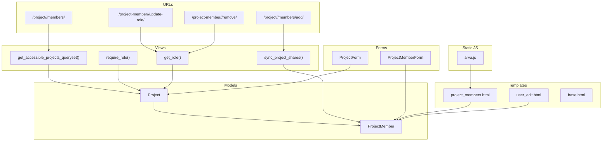
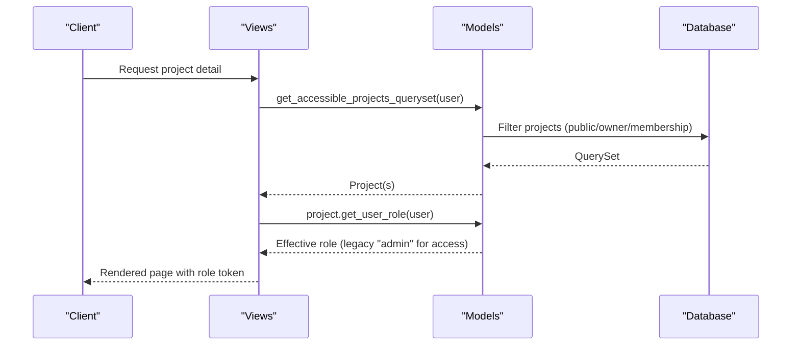
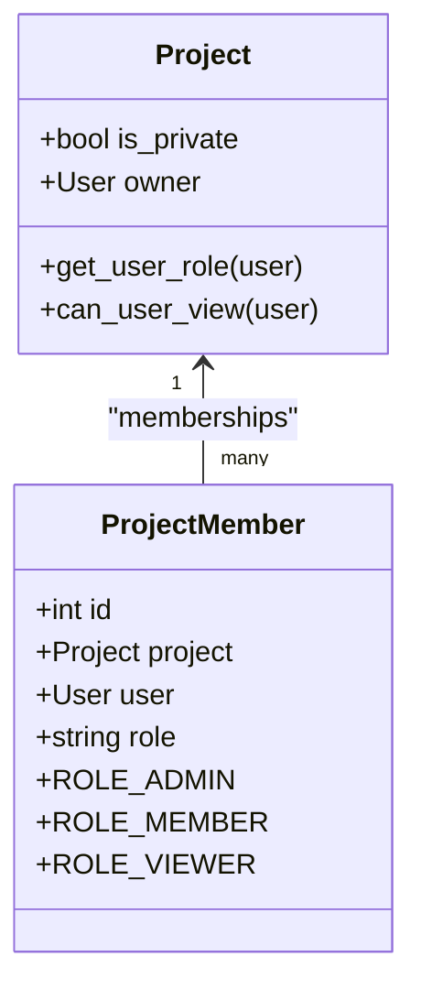
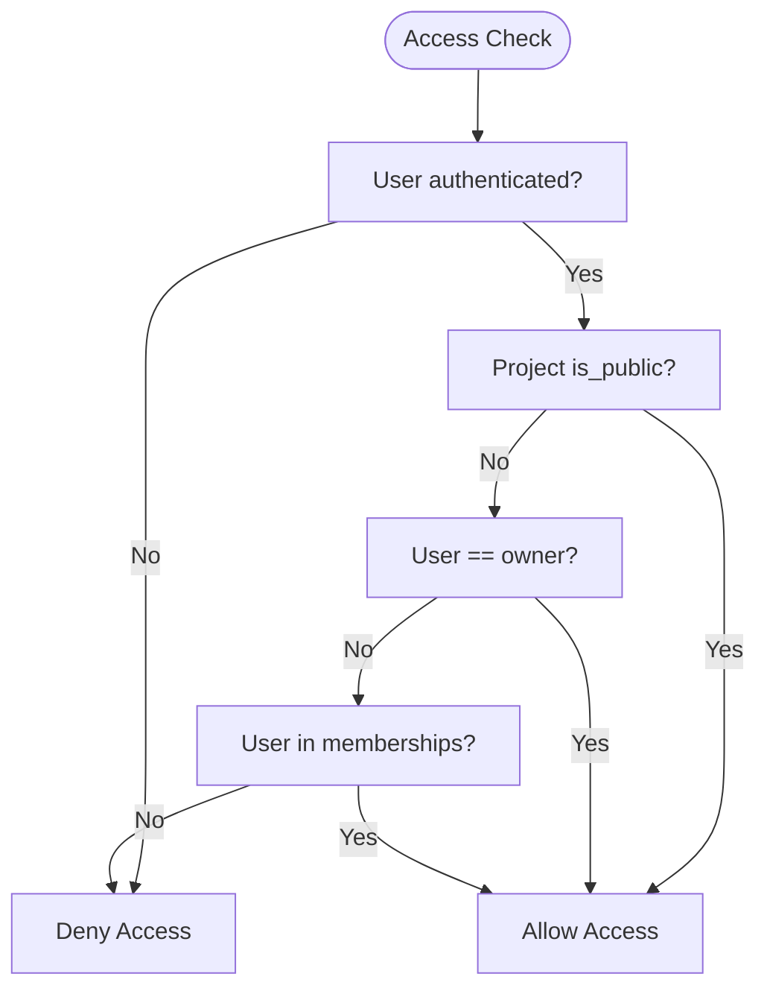
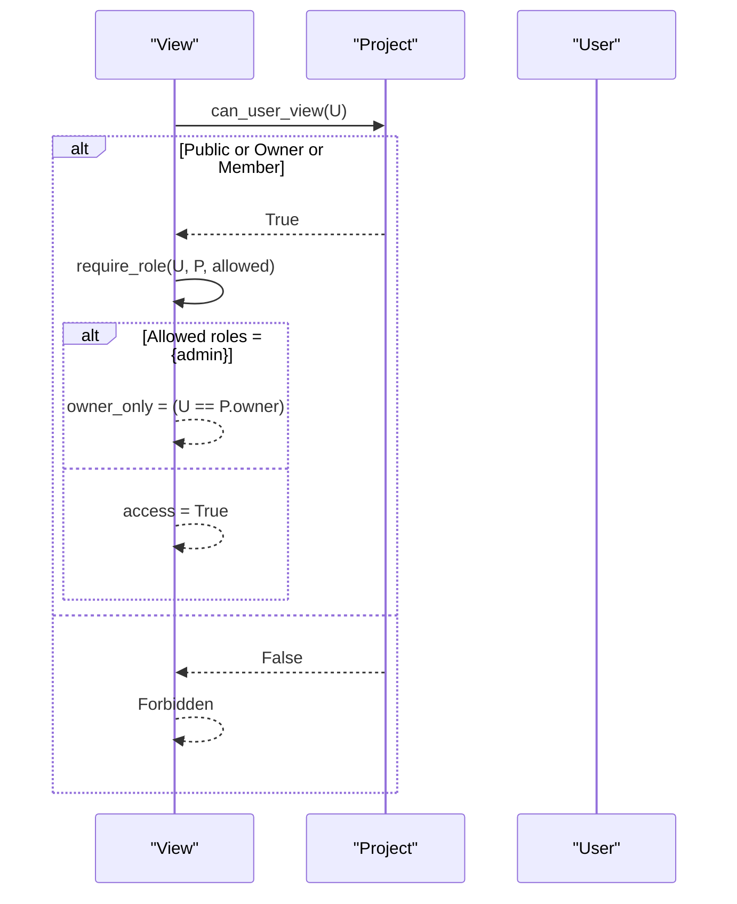
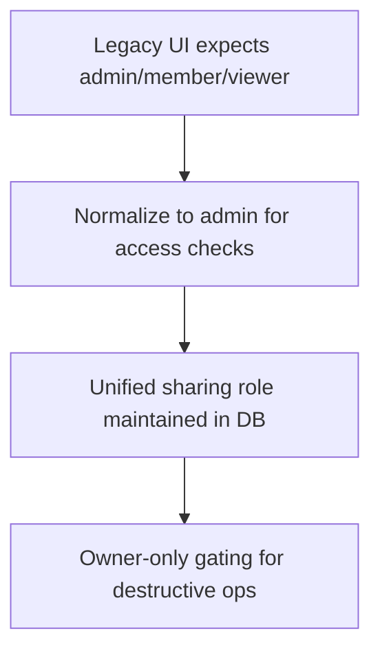
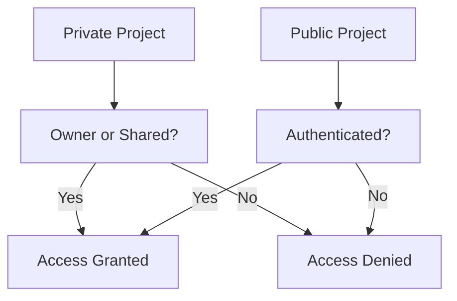
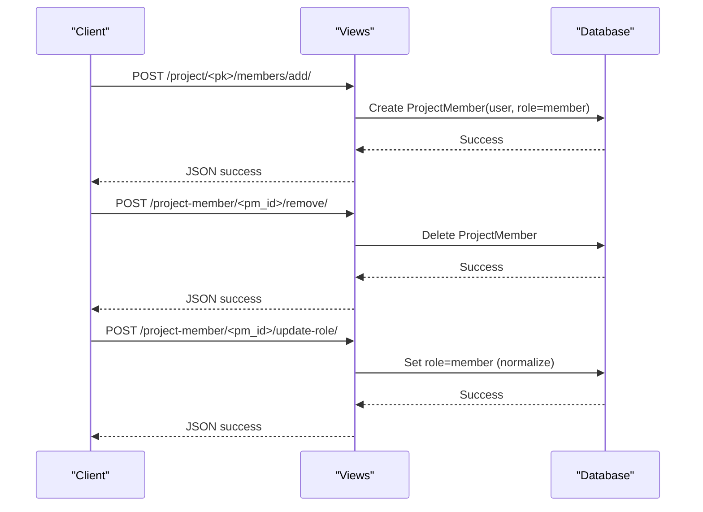
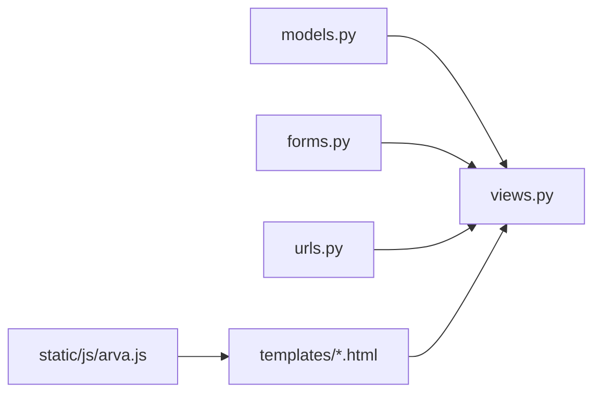

# Role-Based Access Control

<cite>
**Referenced Files in This Document**
- [models.py](file://arva/models.py)
- [views.py](file://arva/views.py)
- [urls.py](file://arva/urls.py)
- [forms.py](file://arva/forms.py)
- [project_members.html](file://arva/templates/arva/project_members.html)
- [user_edit.html](file://arva/templates/arva/user_edit.html)
- [base.html](file://arva/templates/arva/base.html)
- [arva.js](file://static/arva/js/arva.js)
</cite>

## Table of Contents
1. [Introduction](#introduction)
2. [Project Structure](#project-structure)
3. [Core Components](#core-components)
4. [Architecture Overview](#architecture-overview)
5. [Detailed Component Analysis](#detailed-component-analysis)
6. [Dependency Analysis](#dependency-analysis)
7. [Performance Considerations](#performance-considerations)
8. [Troubleshooting Guide](#troubleshooting-guide)
9. [Conclusion](#conclusion)

## Introduction
This document explains the role-based access control (RBAC) system in Arva Kanban. It focuses on the ProjectMember model, the project-level access control mechanism, and how roles and permissions are enforced across the application. The system has deprecated granular team roles in favor of a simplified access model: authenticated project members gain uniform administrative capability for UI and endpoint gating, while ownership remains the authoritative privilege for sensitive operations. Legacy role tokens are preserved for backward compatibility in templates and endpoints.

## Project Structure
The RBAC system spans models, views, URLs, forms, and templates:
- Models define projects, memberships, and access helpers.
- Views enforce access via a require_role gate and a legacy get_role adapter.
- URLs route membership management and project operations.
- Forms encapsulate project sharing and membership creation.
- Templates display roles and provide UI controls for membership management.

**Diagram sources**
- [models.py](file://arva/models.py#L101-L168)
- [models.py](file://arva/models.py#L211-L230)
- [views.py](file://arva/views.py#L50-L56)
- [views.py](file://arva/views.py#L91-L105)
- [views.py](file://arva/views.py#L117-L134)
- [urls.py](file://arva/urls.py#L27-L32)
- [forms.py](file://arva/forms.py#L135-L196)
- [forms.py](file://arva/forms.py#L313-L326)
- [project_members.html](file://arva/templates/arva/project_members.html#L74-L144)
- [user_edit.html](file://arva/templates/arva/user_edit.html#L84-L106)
- [base.html](file://arva/templates/arva/base.html#L288-L298)
- [arva.js](file://static/arva/js/arva.js#L2355-L2374)

**Section sources**
- [models.py](file://arva/models.py#L101-L168)
- [views.py](file://arva/views.py#L50-L56)
- [urls.py](file://arva/urls.py#L27-L32)
- [forms.py](file://arva/forms.py#L135-L196)
- [project_members.html](file://arva/templates/arva/project_members.html#L74-L144)
- [user_edit.html](file://arva/templates/arva/user_edit.html#L84-L106)
- [base.html](file://arva/templates/arva/base.html#L288-L298)
- [arva.js](file://static/arva/js/arva.js#L2355-L2374)

## Core Components
- ProjectMember model defines the membership record with role choices and uniqueness constraint.
- Project.get_user_role determines a user’s effective role for UI and templates, preserving legacy “admin” semantics for non-private projects and owner/admin parity for private ones.
- Project.can_user_view checks whether a user has access to a project.
- Views provide:
  - get_accessible_projects_queryset to filter projects by public/private/ownership/membership.
  - require_role to gate endpoints behind owner-only or project-access checks.
  - get_role to normalize legacy templates to “admin” for all project-access users.
  - sync_project_shares to maintain simplified sharing for private/public projects.
- Forms encapsulate project sharing and membership creation.
- Templates render roles and membership controls, including legacy role options for UI parity.

**Section sources**
- [models.py](file://arva/models.py#L211-L230)
- [models.py](file://arva/models.py#L146-L159)
- [views.py](file://arva/views.py#L50-L56)
- [views.py](file://arva/views.py#L91-L105)
- [views.py](file://arva/views.py#L117-L134)
- [forms.py](file://arva/forms.py#L135-L196)
- [forms.py](file://arva/forms.py#L313-L326)
- [project_members.html](file://arva/templates/arva/project_members.html#L74-L144)
- [user_edit.html](file://arva/templates/arva/user_edit.html#L84-L106)

## Architecture Overview
The RBAC architecture centers on a simplified access model:
- Project-level visibility is determined by public flag, ownership, or explicit membership.
- For UI and legacy endpoints, all project-access users are treated as “admin” to preserve branching logic.
- Owner-only gating remains for destructive operations (e.g., delete project).
- Membership records persist for historical and UI parity but are normalized to a unified sharing role.

**Diagram sources**
- [views.py](file://arva/views.py#L50-L56)
- [models.py](file://arva/models.py#L146-L159)
- [project_detail.html](file://arva/templates/arva/project_detail.html#L700-L720)

**Section sources**
- [views.py](file://arva/views.py#L50-L56)
- [models.py](file://arva/models.py#L146-L159)

## Detailed Component Analysis

### ProjectMember Model and Role Hierarchy
- Roles: admin, member, viewer are defined as constants and choices.
- Membership uniqueness ensures one role per user per project.
- Historical role values are retained for UI parity; backend normalization keeps sharing unified.

**Diagram sources**
- [models.py](file://arva/models.py#L101-L168)
- [models.py](file://arva/models.py#L211-L230)

**Section sources**
- [models.py](file://arva/models.py#L211-L230)

### Project-Level Access Control Mechanism
- Visibility: Users can view a project if it is public, owned by them, or they are explicitly listed as a member.
- Role normalization: For templates and endpoints that branch on “admin”, all project-access users are treated uniformly.
- Owner-only gating: Certain operations (e.g., deleting a project) require the owner.

**Diagram sources**
- [models.py](file://arva/models.py#L146-L159)

**Section sources**
- [models.py](file://arva/models.py#L146-L159)

### Permission Checking Logic in Views
- get_accessible_projects_queryset filters projects by public flag, ownership, or membership.
- require_role gates endpoints: if allowed roles include only admin, owner-only access is enforced; otherwise, project access suffices.
- get_role normalizes legacy templates to “admin” for all project-access users.

**Diagram sources**
- [views.py](file://arva/views.py#L50-L56)
- [views.py](file://arva/views.py#L91-L105)

**Section sources**
- [views.py](file://arva/views.py#L50-L56)
- [views.py](file://arva/views.py#L91-L105)

### Legacy Role System Deprecation and Backward Compatibility
- The legacy role system (admin/member/viewer) persists in templates and forms for UI parity.
- Backend normalization treats all project-access users as “admin” for legacy branches.
- Role updates and removals are gated and normalized to a unified sharing role.

**Diagram sources**
- [views.py](file://arva/views.py#L91-L105)
- [views.py](file://arva/views.py#L370-L379)

**Section sources**
- [views.py](file://arva/views.py#L91-L105)
- [views.py](file://arva/views.py#L370-L379)

### Private vs Shared Projects Access Patterns
- Private projects: access restricted to owner plus explicitly shared users; membership records define who can view.
- Shared (public) projects: all authenticated users can view; membership records may exist but do not elevate roles beyond access.

**Diagram sources**
- [models.py](file://arva/models.py#L146-L159)

**Section sources**
- [models.py](file://arva/models.py#L146-L159)

### Relationship Between Ownership and Admin Privileges
- Ownership is the authoritative privilege for sensitive operations (e.g., delete project).
- For UI and legacy endpoints, project-access users are normalized to “admin” to preserve branching logic.

**Section sources**
- [views.py](file://arva/views.py#L1104-L1110)
- [views.py](file://arva/views.py#L91-L105)

### Membership Queries and Optimization
- get_accessible_projects_queryset uses a single filtered QuerySet with distinct to avoid duplicates.
- Views prefetch related memberships and users to minimize N+1 queries.
- Project.shared_user_count leverages membership count for quick stats.

**Section sources**
- [views.py](file://arva/views.py#L50-L56)
- [views.py](file://arva/views.py#L394-L414)
- [models.py](file://arva/models.py#L165-L168)

### Examples from the Codebase

#### Role Determination Methods
- Project.get_user_role returns a normalized role for UI and templates.
- Project.can_user_view checks access eligibility.

**Section sources**
- [models.py](file://arva/models.py#L146-L159)

#### Permission Validation in Views
- require_role enforces owner-only or project-access gating.
- get_role normalizes legacy “admin” token for templates.

**Section sources**
- [views.py](file://arva/views.py#L91-L105)

#### Access Control Enforcement in Templates
- project_members.html displays roles and allows editing/removal for non-owner members.
- user_edit.html shows user memberships with role selectors for UI parity.

**Section sources**
- [project_members.html](file://arva/templates/arva/project_members.html#L74-L144)
- [user_edit.html](file://arva/templates/arva/user_edit.html#L84-L106)

#### JavaScript Interaction for Role Updates
- arva.js handles role change events and posts to project-member endpoints.

**Section sources**
- [arva.js](file://static/arva/js/arva.js#L2355-L2374)

### Common Access Control Scenarios

#### Adding/Removing Project Members
- ProjectForm supports shared_users for private projects; shared_role defaults to member.
- project_member_add routes create membership entries.
- project_member_remove deletes membership records.
- project_member_update_role normalizes role to member for legacy compatibility.

**Diagram sources**
- [urls.py](file://arva/urls.py#L29-L32)
- [urls.py](file://arva/urls.py#L77-L78)
- [views.py](file://arva/views.py#L370-L379)

**Section sources**
- [forms.py](file://arva/forms.py#L135-L196)
- [urls.py](file://arva/urls.py#L29-L32)
- [urls.py](file://arva/urls.py#L77-L78)
- [views.py](file://arva/views.py#L370-L379)

#### Role Changes and Edge Cases
- Role updates are normalized to member for legacy UI compatibility.
- Owner cannot be removed or edited via role selector in templates.
- Non-superusers cannot modify memberships.

**Section sources**
- [views.py](file://arva/views.py#L370-L379)
- [project_members.html](file://arva/templates/arva/project_members.html#L90-L107)
- [user_edit.html](file://arva/templates/arva/user_edit.html#L97-L105)

## Dependency Analysis
- Models depend on Django auth User and define ProjectMember and Project.
- Views depend on models for access checks and on forms for project sharing.
- URLs route membership and project operations to views.
- Forms depend on models to populate querysets and enforce constraints.
- Templates depend on views for context and on models for role display.

**Diagram sources**
- [models.py](file://arva/models.py#L101-L168)
- [views.py](file://arva/views.py#L50-L56)
- [forms.py](file://arva/forms.py#L135-L196)
- [urls.py](file://arva/urls.py#L27-L32)
- [project_members.html](file://arva/templates/arva/project_members.html#L74-L144)

**Section sources**
- [models.py](file://arva/models.py#L101-L168)
- [views.py](file://arva/views.py#L50-L56)
- [forms.py](file://arva/forms.py#L135-L196)
- [urls.py](file://arva/urls.py#L27-L32)
- [project_members.html](file://arva/templates/arva/project_members.html#L74-L144)

## Performance Considerations
- Use select_related and prefetch_related in views to reduce database queries for project lists and membership details.
- Keep membership synchronization minimal and batched when updating shares.
- Avoid redundant access checks by caching can_user_view results per request when appropriate.

## Troubleshooting Guide
- If a user cannot access a project:
  - Verify project visibility rules: public, owner, or membership.
  - Confirm get_accessible_projects_queryset filtering is applied.
- If role updates appear ineffective:
  - Ensure project_member_update_role is invoked and normalized to member.
  - Check that the requester has sufficient permissions.
- If templates show unexpected roles:
  - get_role normalizes to “admin” for all project-access users; confirm UI expectations.

**Section sources**
- [models.py](file://arva/models.py#L146-L159)
- [views.py](file://arva/views.py#L50-L56)
- [views.py](file://arva/views.py#L370-L379)
- [views.py](file://arva/views.py#L91-L105)

## Conclusion
Arva Kanban’s RBAC system has evolved toward a simplified model: project access grants uniform administrative capability for UI and endpoint gating, while ownership remains the authoritative privilege for sensitive operations. The ProjectMember model preserves legacy role semantics for backward compatibility, ensuring smooth transitions without breaking existing UI logic. Views enforce access consistently, and templates reflect roles for parity. Membership management remains streamlined, with normalized sharing and owner-only controls for destructive actions.