# User Management and Authentication

<cite>
**Referenced Files in This Document**
- [models.py](file://arva/models.py)
- [views.py](file://arva/views.py)
- [forms.py](file://arva/forms.py)
- [urls.py](file://arva/urls.py)
- [arviga/urls.py](file://arviga/urls.py)
- [middleware.py](file://arva/middleware.py)
- [signals.py](file://arva/signals.py)
- [admin.py](file://arva/admin.py)
- [utils.py](file://arva/utils.py)
- [templatetags/arva_tags.py](file://arva/templatetags/arva_tags.py)
- [templates/account/login.html](file://arva/templates/account/login.html)
- [templates/arva/auth_login.html](file://arva/templates/arva/auth_login.html)
- [templates/arva/auth_register.html](file://arva/templates/arva/auth_register.html)
</cite>

## Table of Contents
1. [Introduction](#introduction)
2. [Project Structure](#project-structure)
3. [Core Components](#core-components)
4. [Architecture Overview](#architecture-overview)
5. [Detailed Component Analysis](#detailed-component-analysis)
6. [Dependency Analysis](#dependency-analysis)
7. [Performance Considerations](#performance-considerations)
8. [Troubleshooting Guide](#troubleshooting-guide)
9. [Conclusion](#conclusion)
10. [Appendices](#appendices)

## Introduction
This document explains the user management and authentication system in Arva Kanban. It covers user registration, profile management, authentication flows (including Django authentication and Google OAuth), role-based access control semantics, user preferences (theme and layout), website-wide settings, session and activity tracking, and administrative capabilities. It also documents the integration with Django AllAuth for social authentication, email verification, and password reset flows.

## Project Structure
The authentication and user management features span several modules:
- Models define user profiles, preferences, website settings, and project membership semantics.
- Views implement registration, login/logout, user settings, preference updates, and administrative user management.
- Forms handle registration, profile editing, and admin password resets.
- URLs route authentication endpoints and integrate AllAuth.
- Templates provide login, registration, and settings UIs.
- Signals automate profile creation and Google avatar fetching.
- Middleware tracks user activity and enforces maintenance mode.
- Template tags compute effective theme and layout for rendering.
- Admin exposes models for management.

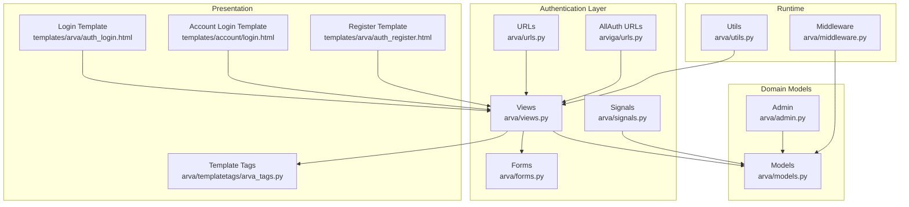

**Diagram sources**
- [urls.py](file://arva/urls.py#L1-L98)
- [arviga/urls.py](file://arviga/urls.py#L1-L15)
- [views.py](file://arva/views.py#L1-L800)
- [forms.py](file://arva/forms.py#L1-L326)
- [models.py](file://arva/models.py#L1-L445)
- [admin.py](file://arva/admin.py#L1-L50)
- [signals.py](file://arva/signals.py#L1-L86)
- [templatetags/arva_tags.py](file://arva/templatetags/arva_tags.py#L1-L34)
- [middleware.py](file://arva/middleware.py#L1-L39)
- [utils.py](file://arva/utils.py#L1-L29)
- [templates/arva/auth_login.html](file://arva/templates/arva/auth_login.html#L1-L89)
- [templates/account/login.html](file://arva/templates/account/login.html#L1-L23)
- [templates/arva/auth_register.html](file://arva/templates/arva/auth_register.html#L1-L22)

**Section sources**
- [urls.py](file://arva/urls.py#L1-L98)
- [arviga/urls.py](file://arviga/urls.py#L1-L15)
- [views.py](file://arva/views.py#L1-L800)
- [forms.py](file://arva/forms.py#L1-L326)
- [models.py](file://arva/models.py#L1-L445)
- [admin.py](file://arva/admin.py#L1-L50)
- [signals.py](file://arva/signals.py#L1-L86)
- [templatetags/arva_tags.py](file://arva/templatetags/arva_tags.py#L1-L34)
- [middleware.py](file://arva/middleware.py#L1-L39)
- [utils.py](file://arva/utils.py#L1-L29)
- [templates/arva/auth_login.html](file://arva/templates/arva/auth_login.html#L1-L89)
- [templates/account/login.html](file://arva/templates/account/login.html#L1-L23)
- [templates/arva/auth_register.html](file://arva/templates/arva/auth_register.html#L1-L22)

## Core Components
- User and Profile
  - Django User is extended via a OneToOne UserProfile containing avatar storage, Google ID, theme preference, and layout preference.
  - WebsiteSettings centralizes branding and theme defaults.
- Authentication Views
  - Login and logout endpoints; custom logout supports AllAuth cleanup.
  - Registration uses a dedicated form and logs in newly registered users.
- Preferences and Settings
  - Per-user theme and layout preferences; website-wide settings for admins.
  - AJAX endpoints to update theme and layout preferences.
- Permissions and Access Control
  - Project access checks; legacy role tokens preserved for UI compatibility.
  - Owner-only controls for sensitive endpoints; project-view access gatekeeping.
- Administrative User Management
  - Superuser-only endpoints to list, edit, toggle activity, reset passwords, and delete users.
  - Inline user creation with hashed passwords.
- Session and Activity Tracking
  - Middleware updates UserActivity timestamps periodically.
  - Utilities determine online presence.
- Email and Social Auth
  - AllAuth integration for Google OAuth.
  - Signals create profiles, fetch Google avatars, and send welcome emails on signup.

**Section sources**
- [models.py](file://arva/models.py#L56-L100)
- [models.py](file://arva/models.py#L15-L55)
- [models.py](file://arva/models.py#L101-L160)
- [views.py](file://arva/views.py#L57-L68)
- [views.py](file://arva/views.py#L70-L82)
- [views.py](file://arva/views.py#L136-L160)
- [views.py](file://arva/views.py#L163-L188)
- [views.py](file://arva/views.py#L192-L216)
- [views.py](file://arva/views.py#L219-L245)
- [views.py](file://arva/views.py#L248-L268)
- [views.py](file://arva/views.py#L271-L316)
- [views.py](file://arva/views.py#L334-L348)
- [views.py](file://arva/views.py#L352-L366)
- [middleware.py](file://arva/middleware.py#L7-L22)
- [utils.py](file://arva/utils.py#L6-L9)
- [signals.py](file://arva/signals.py#L14-L18)
- [signals.py](file://arva/signals.py#L19-L38)
- [signals.py](file://arva/signals.py#L39-L61)

## Architecture Overview
The system integrates Django’s built-in authentication with Django AllAuth for Google OAuth. User profiles are lazily created upon user save. Preferences are stored per user and override global website settings when applicable. Middleware keeps track of user activity, and template tags compute effective theme and layout for rendering.

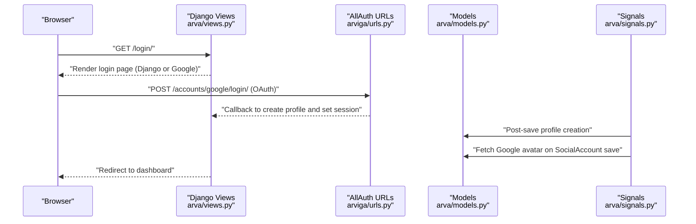

**Diagram sources**
- [urls.py](file://arva/urls.py#L7-L8)
- [arviga/urls.py](file://arviga/urls.py#L9-L10)
- [views.py](file://arva/views.py#L70-L82)
- [signals.py](file://arva/signals.py#L14-L18)
- [signals.py](file://arva/signals.py#L19-L38)

## Detailed Component Analysis

### User Registration and Login
- Registration
  - View validates form, saves user, logs them in, and redirects to project list.
  - Form is a standard creation form with username, email, and password confirmation.
- Login
  - Uses Django’s LoginView with a custom template supporting Google OAuth via AllAuth.
  - Google OAuth button is rendered via AllAuth’s provider_login_url tag.
- Logout
  - Custom view performs Django logout and clears AllAuth-specific session data, then redirects to login.

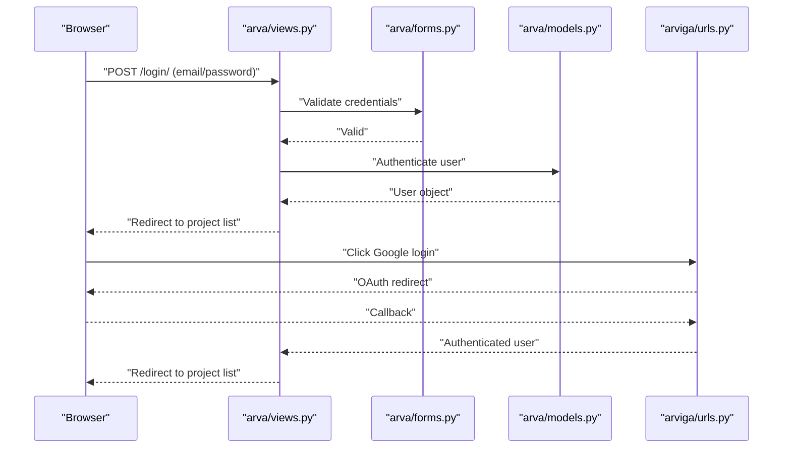

**Diagram sources**
- [views.py](file://arva/views.py#L57-L68)
- [views.py](file://arva/views.py#L70-L82)
- [forms.py](file://arva/forms.py#L128-L134)
- [urls.py](file://arva/urls.py#L7-L8)
- [arviga/urls.py](file://arviga/urls.py#L9-L10)

**Section sources**
- [views.py](file://arva/views.py#L57-L68)
- [views.py](file://arva/views.py#L70-L82)
- [forms.py](file://arva/forms.py#L128-L134)
- [urls.py](file://arva/urls.py#L7-L8)
- [arviga/urls.py](file://arviga/urls.py#L9-L10)
- [templates/arva/auth_login.html](file://arva/templates/arva/auth_login.html#L68-L80)
- [templates/account/login.html](file://arva/templates/account/login.html#L8-L10)

### Profile Management and Preferences
- Profile model stores avatar (file or icon), Google ID, theme preference, and layout preference.
- Theme preference supports inherit/light/dark/auto; layout supports sidebar/classic.
- Effective theme and layout are computed by template tags, falling back to website defaults or sidebar when unauthenticated.
- User settings page renders theme/layout controls and optionally website settings for superusers in classic layout.

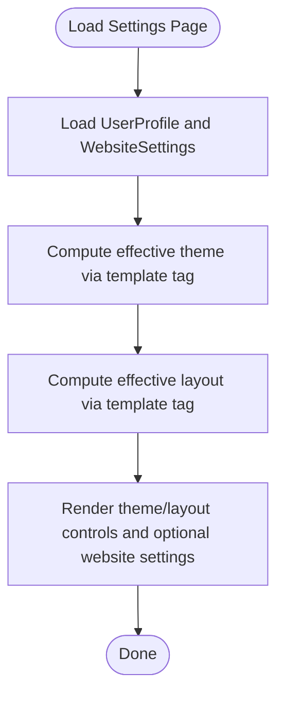

**Diagram sources**
- [models.py](file://arva/models.py#L56-L100)
- [models.py](file://arva/models.py#L15-L55)
- [templatetags/arva_tags.py](file://arva/templatetags/arva_tags.py#L11-L27)
- [views.py](file://arva/views.py#L136-L160)
- [views.py](file://arva/views.py#L163-L188)

**Section sources**
- [models.py](file://arva/models.py#L56-L100)
- [models.py](file://arva/models.py#L15-L55)
- [templatetags/arva_tags.py](file://arva/templatetags/arva_tags.py#L11-L27)
- [views.py](file://arva/views.py#L136-L160)
- [views.py](file://arva/views.py#L163-L188)

### Preference Update Endpoints
- AJAX endpoints update user theme and layout preferences atomically and return JSON responses.
- Validation ensures posted values match allowed choices.

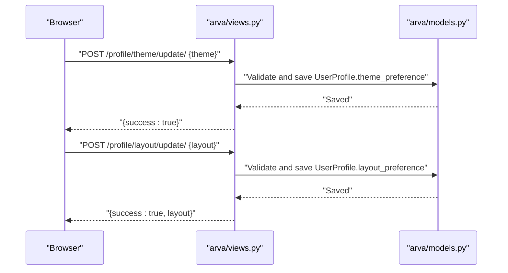

**Diagram sources**
- [views.py](file://arva/views.py#L192-L216)
- [models.py](file://arva/models.py#L75-L88)

**Section sources**
- [views.py](file://arva/views.py#L192-L216)
- [models.py](file://arva/models.py#L75-L88)

### Role-Based Access Control and Project Permissions
- Access checks rely on project visibility rules:
  - Public projects are visible to all authenticated users.
  - Private projects are visible only to the owner and explicitly shared users.
- Legacy role tokens are preserved for UI compatibility; endpoint gating remains owner-only for historically privileged actions.
- Helper functions encapsulate access checks and role resolution.

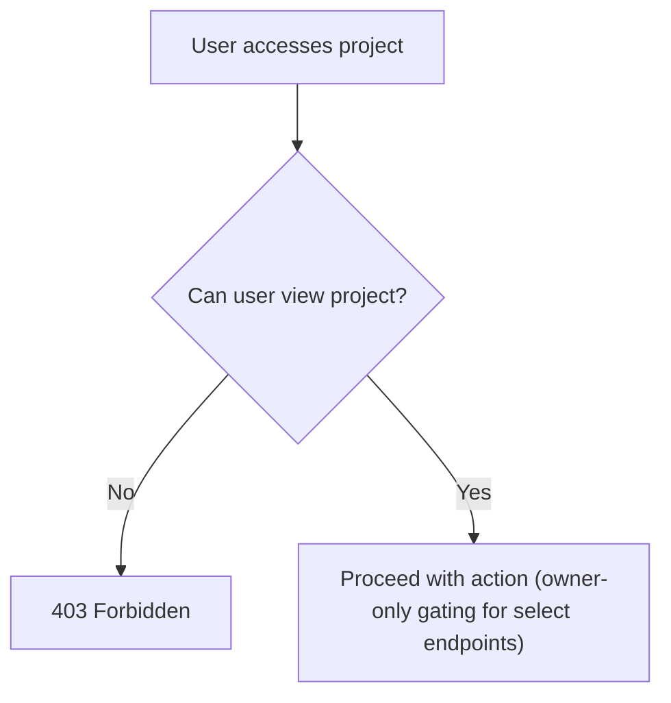

**Diagram sources**
- [models.py](file://arva/models.py#L146-L160)
- [views.py](file://arva/views.py#L91-L104)

**Section sources**
- [models.py](file://arva/models.py#L146-L160)
- [views.py](file://arva/views.py#L91-L104)

### Administrative User Management
- Superuser-only endpoints:
  - List users with aggregated activity timestamps.
  - Inline user creation with hashed passwords.
  - Edit user profiles, upload avatars (file or icon), and view memberships.
  - Toggle user activity status.
  - Reset user passwords (admin-initiated).
  - Hard-delete users with safety checks (no self-deletion, no deletion of other superusers).
- Project member management endpoints maintain legacy compatibility by keeping memberships uniform.

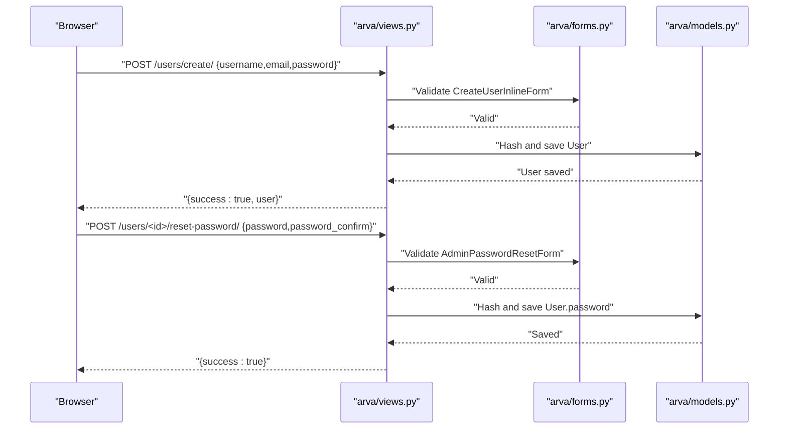

**Diagram sources**
- [views.py](file://arva/views.py#L248-L268)
- [views.py](file://arva/views.py#L334-L348)
- [forms.py](file://arva/forms.py#L67-L84)
- [forms.py](file://arva/forms.py#L110-L126)

**Section sources**
- [views.py](file://arva/views.py#L219-L245)
- [views.py](file://arva/views.py#L248-L268)
- [views.py](file://arva/views.py#L271-L316)
- [views.py](file://arva/views.py#L318-L348)
- [views.py](file://arva/views.py#L352-L366)
- [forms.py](file://arva/forms.py#L67-L84)
- [forms.py](file://arva/forms.py#L110-L126)

### Session Management and Activity Tracking
- Middleware periodically updates UserActivity timestamps for authenticated users and stores a last activity marker in the session.
- Utility determines whether a user is considered online based on last activity.
- Maintenance mode middleware blocks non-superusers when maintenance mode is enabled.

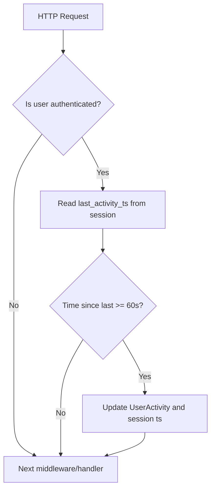

**Diagram sources**
- [middleware.py](file://arva/middleware.py#L11-L22)
- [utils.py](file://arva/utils.py#L6-L9)

**Section sources**
- [middleware.py](file://arva/middleware.py#L7-L22)
- [utils.py](file://arva/utils.py#L6-L9)
- [middleware.py](file://arva/middleware.py#L24-L39)

### Google OAuth Integration and Email Workflows
- AllAuth routes are included under accounts/, enabling OAuth providers.
- On first-time Google sign-up:
  - Profile is created automatically.
  - Google avatar is fetched and saved to the user’s profile.
  - A welcome email is sent asynchronously.

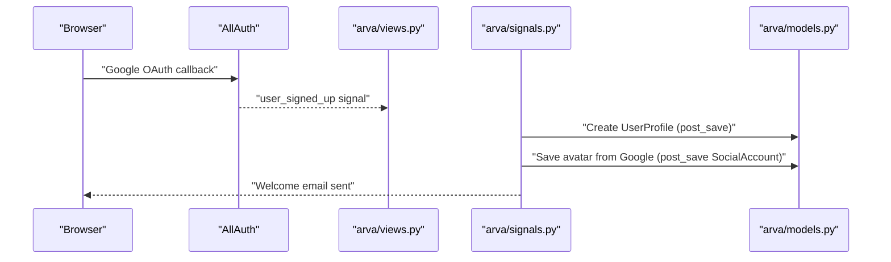

**Diagram sources**
- [arviga/urls.py](file://arviga/urls.py#L9-L10)
- [signals.py](file://arva/signals.py#L14-L18)
- [signals.py](file://arva/signals.py#L19-L38)
- [signals.py](file://arva/signals.py#L39-L61)

**Section sources**
- [arviga/urls.py](file://arviga/urls.py#L9-L10)
- [signals.py](file://arva/signals.py#L14-L18)
- [signals.py](file://arva/signals.py#L19-L38)
- [signals.py](file://arva/signals.py#L39-L61)

### Website Settings and Theme Defaults
- WebsiteSettings defines site-wide branding and theme defaults.
- Effective theme computation falls back to WebsiteSettings when user preference is “inherit” or missing.
- Classic layout restricts website settings to the unified settings page.

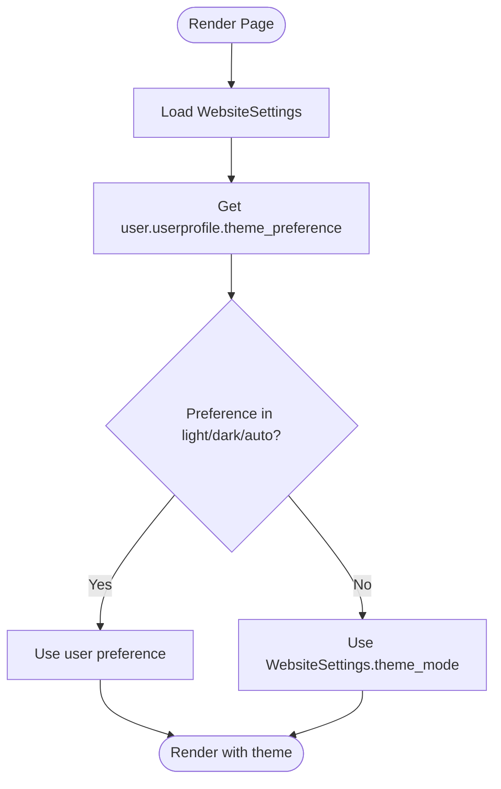

**Diagram sources**
- [models.py](file://arva/models.py#L15-L55)
- [templatetags/arva_tags.py](file://arva/templatetags/arva_tags.py#L11-L19)
- [views.py](file://arva/views.py#L163-L188)

**Section sources**
- [models.py](file://arva/models.py#L15-L55)
- [templatetags/arva_tags.py](file://arva/templatetags/arva_tags.py#L11-L19)
- [views.py](file://arva/views.py#L163-L188)

## Dependency Analysis
- Views depend on Models, Forms, and template tags for rendering and logic.
- Signals depend on AllAuth models and Django User to create profiles and fetch avatars.
- Middleware depends on Models for activity tracking and WebsiteSettings for maintenance mode.
- URLs connect Django auth, AllAuth, and app endpoints.

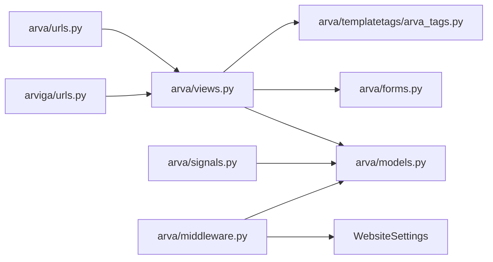

**Diagram sources**
- [views.py](file://arva/views.py#L1-L800)
- [models.py](file://arva/models.py#L1-L445)
- [forms.py](file://arva/forms.py#L1-L326)
- [templatetags/arva_tags.py](file://arva/templatetags/arva_tags.py#L1-L34)
- [middleware.py](file://arva/middleware.py#L1-L39)
- [urls.py](file://arva/urls.py#L1-L98)
- [arviga/urls.py](file://arviga/urls.py#L1-L15)
- [signals.py](file://arva/signals.py#L1-L86)

**Section sources**
- [views.py](file://arva/views.py#L1-L800)
- [models.py](file://arva/models.py#L1-L445)
- [forms.py](file://arva/forms.py#L1-L326)
- [templatetags/arva_tags.py](file://arva/templatetags/arva_tags.py#L1-L34)
- [middleware.py](file://arva/middleware.py#L1-L39)
- [urls.py](file://arva/urls.py#L1-L98)
- [arviga/urls.py](file://arviga/urls.py#L1-L15)
- [signals.py](file://arva/signals.py#L1-L86)

## Performance Considerations
- Middleware updates UserActivity only after a 60-second interval to reduce database writes.
- WebsiteSettings are cached for maintenance mode checks to avoid repeated DB queries.
- Preference computations in template tags short-circuit to defaults when unnecessary.
- Avoid excessive avatar fetches; Google avatar fetching occurs once per SocialAccount creation.

[No sources needed since this section provides general guidance]

## Troubleshooting Guide
- Login fails with invalid credentials
  - Verify form validation and Django authentication flow.
  - Check AllAuth provider configuration and callback URLs.
- Google OAuth does not set avatar
  - Confirm SocialAccount post-save signal runs and network fetch succeeds.
- Theme/layout changes not applied
  - Ensure AJAX endpoints receive allowed values and responses are handled client-side.
- Maintenance mode blocking access
  - Non-superusers are redirected to maintenance page when maintenance mode is enabled.
- Admin endpoints return forbidden
  - Confirm caller is superuser and not attempting self-deletion or deleting another superuser.

**Section sources**
- [views.py](file://arva/views.py#L192-L216)
- [middleware.py](file://arva/middleware.py#L24-L39)
- [signals.py](file://arva/signals.py#L19-L38)
- [views.py](file://arva/views.py#L352-L366)

## Conclusion
Arva Kanban’s user management and authentication system combines Django’s native authentication with AllAuth for Google OAuth, ensuring secure and flexible sign-in options. Profiles store user preferences and avatars, while template tags and middleware ensure a responsive UI and accurate activity tracking. Administrative controls are restricted to superusers, and project access is governed by explicit visibility rules. The system balances simplicity with extensibility, enabling straightforward onboarding, profile updates, and administrative tasks.

[No sources needed since this section summarizes without analyzing specific files]

## Appendices

### Common Scenarios and References
- User onboarding
  - Registration and automatic login: [views.py](file://arva/views.py#L57-L68)
  - Google OAuth login: [urls.py](file://arva/urls.py#L7-L8), [arviga/urls.py](file://arviga/urls.py#L9-L10)
- Profile updates
  - Edit user and avatar: [views.py](file://arva/views.py#L271-L316), [forms.py](file://arva/forms.py#L51-L66)
  - Theme and layout updates: [views.py](file://arva/views.py#L192-L216)
- Role changes and project access
  - Access checks and owner-only gating: [models.py](file://arva/models.py#L146-L160), [views.py](file://arva/views.py#L91-L104)
- Administrative tasks
  - User listing and inline creation: [views.py](file://arva/views.py#L219-L268)
  - Password reset and toggling activity: [views.py](file://arva/views.py#L318-L348)
  - Deleting users: [views.py](file://arva/views.py#L352-L366)
- Email and social workflows
  - Welcome email and avatar fetch: [signals.py](file://arva/signals.py#L39-L61), [signals.py](file://arva/signals.py#L19-L38)