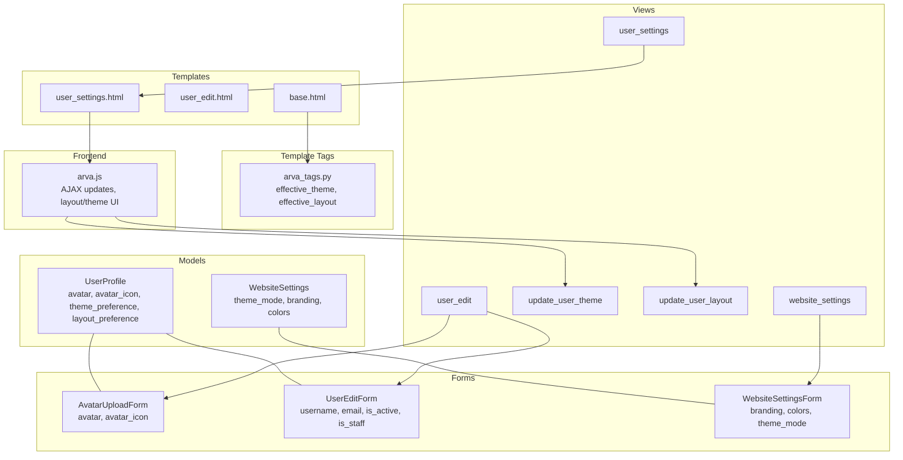
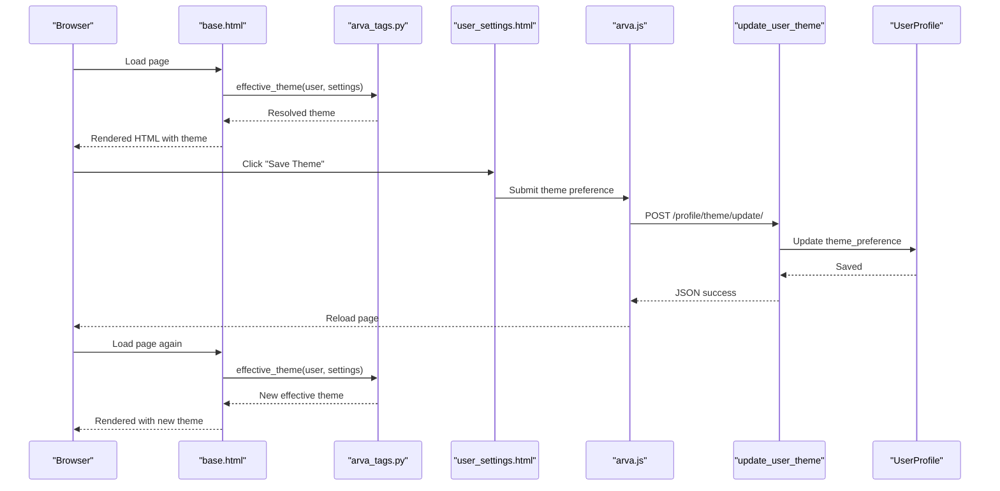
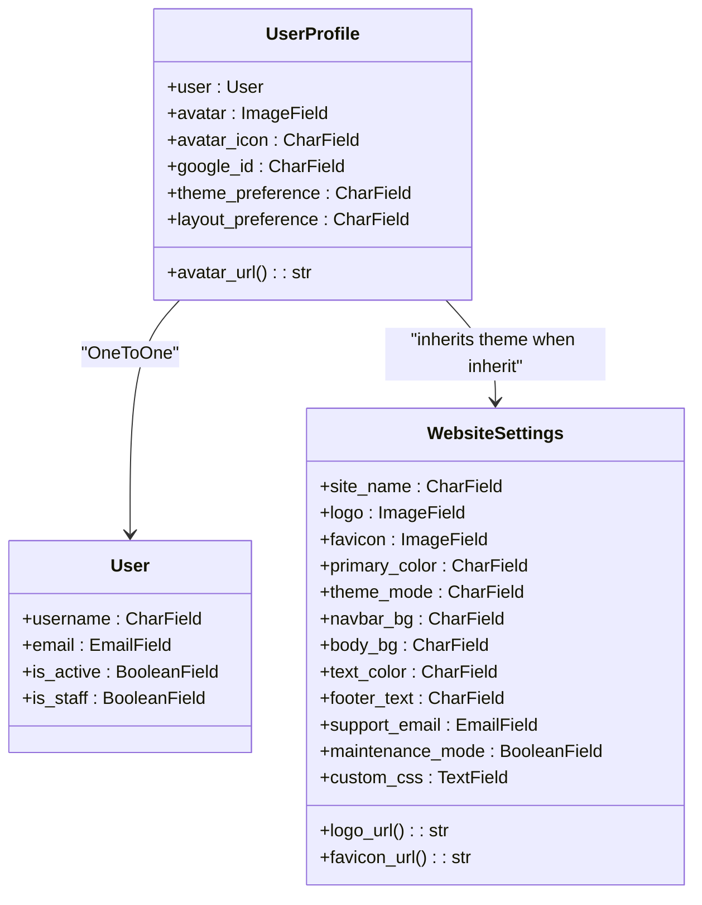
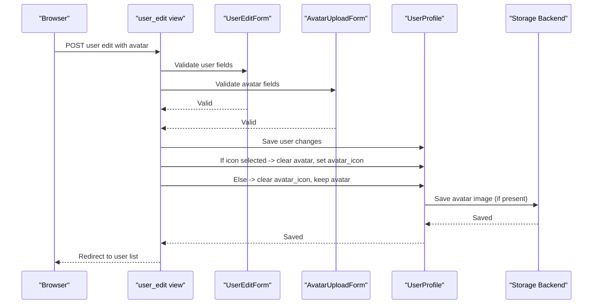
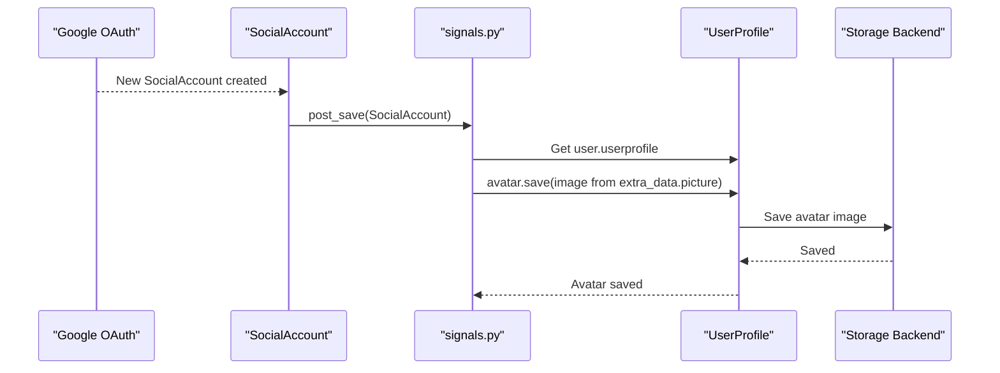
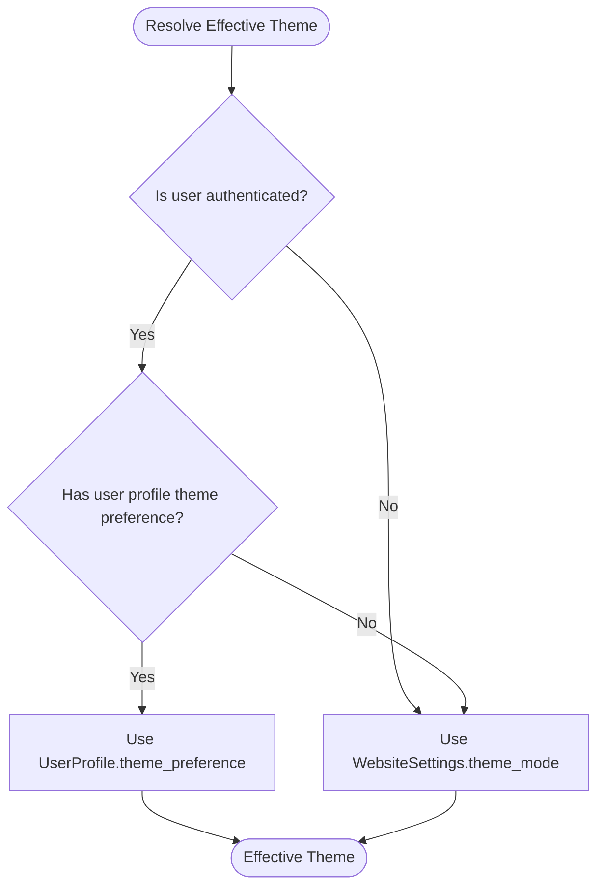
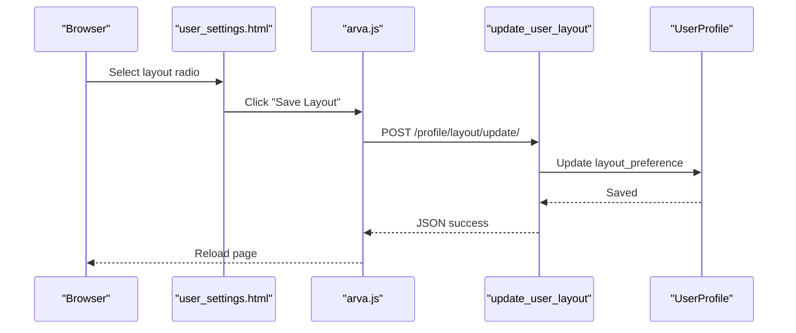
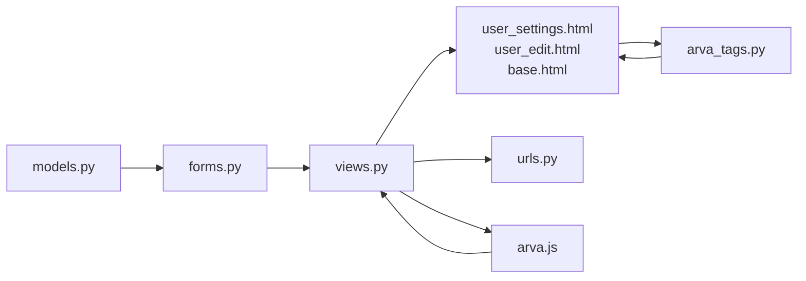

# User Profile Management

<cite>
**Referenced Files in This Document**
- [models.py](file://arva/models.py)
- [views.py](file://arva/views.py)
- [forms.py](file://arva/forms.py)
- [urls.py](file://arva/urls.py)
- [user_settings.html](file://arva/templates/arva/user_settings.html)
- [user_edit.html](file://arva/templates/arva/user_edit.html)
- [base.html](file://arva/templates/arva/base.html)
- [arva_tags.py](file://arva/templatetags/arva_tags.py)
- [arva.js](file://static/arva/js/arva.js)
- [sidebar.css](file://static/arva/css/layout/sidebar.css)
- [classic.css](file://static/arva/css/layout/classic.css)
- [user_settings.css](file://static/arva/css/pages/user_settings.css)
- [signals.py](file://arva/signals.py)
</cite>

## Table of Contents
1. [Introduction](#introduction)
2. [Project Structure](#project-structure)
3. [Core Components](#core-components)
4. [Architecture Overview](#architecture-overview)
5. [Detailed Component Analysis](#detailed-component-analysis)
6. [Dependency Analysis](#dependency-analysis)
7. [Performance Considerations](#performance-considerations)
8. [Troubleshooting Guide](#troubleshooting-guide)
9. [Conclusion](#conclusion)

## Introduction
This document provides comprehensive documentation for user profile management functionality in Arva Kanban. It covers the UserProfile model structure, avatar management (including image uploads and icon selection), Google OAuth integration for avatar fetching, and profile customization options. It also documents the user settings interface (theme preferences and layout options), profile editing forms, avatar upload handling, and the relationship between website-wide settings and individual user preferences. The document includes concrete examples from the codebase showing profile update views, form processing, and template rendering, along with avatar fallback systems, preference inheritance, and UI impact of profile changes.

## Project Structure
User profile management spans several key areas:
- Data model layer: UserProfile and WebsiteSettings models
- Forms layer: AvatarUploadForm, UserEditForm, WebsiteSettingsForm
- Views layer: user_settings, website_settings, update_user_theme, update_user_layout, user_edit
- Templates: user_settings.html, user_edit.html, base.html
- Template tags: effective_theme, effective_layout resolution
- Frontend: arva.js for AJAX theme/layout updates
- Static assets: CSS for layouts and settings page styling

**Diagram sources**
- [models.py](file://arva/models.py#L56-L99)
- [forms.py](file://arva/forms.py#L51-L66)
- [views.py](file://arva/views.py#L136-L216)
- [user_settings.html](file://arva/templates/arva/user_settings.html#L1-L171)
- [user_edit.html](file://arva/templates/arva/user_edit.html#L1-L155)
- [base.html](file://arva/templates/arva/base.html#L1-L362)
- [arva_tags.py](file://arva/templatetags/arva_tags.py#L1-L34)
- [arva.js](file://static/arva/js/arva.js#L694-L748)

**Section sources**
- [models.py](file://arva/models.py#L56-L99)
- [forms.py](file://arva/forms.py#L51-L66)
- [views.py](file://arva/views.py#L136-L216)
- [urls.py](file://arva/urls.py#L80-L84)

## Core Components
- UserProfile model: Stores per-user preferences and avatar data, including theme_preference and layout_preference.
- WebsiteSettings model: Holds global website-wide theme and branding settings.
- AvatarUploadForm: Handles avatar image uploads and icon selection.
- UserEditForm: Updates basic user account details.
- Template tags: effective_theme and effective_layout resolve the effective theme and layout for rendering.
- Views: user_settings, website_settings, update_user_theme, update_user_layout, user_edit.
- Templates: user_settings.html and user_edit.html render the UI for profile management.
- Frontend: arva.js handles AJAX updates for theme and layout preferences.

**Section sources**
- [models.py](file://arva/models.py#L56-L99)
- [models.py](file://arva/models.py#L15-L42)
- [forms.py](file://arva/forms.py#L51-L66)
- [forms.py](file://arva/forms.py#L86-L108)
- [arva_tags.py](file://arva/templatetags/arva_tags.py#L10-L27)
- [views.py](file://arva/views.py#L136-L216)
- [user_settings.html](file://arva/templates/arva/user_settings.html#L1-L171)
- [user_edit.html](file://arva/templates/arva/user_edit.html#L1-L155)
- [arva.js](file://static/arva/js/arva.js#L694-L748)

## Architecture Overview
The user profile management system follows a layered architecture:
- Model layer defines data structures and relationships.
- Form layer validates and processes user input.
- View layer orchestrates request handling, form processing, and response rendering.
- Template layer renders UI with dynamic theme and layout resolution.
- Template tag layer resolves effective theme and layout for the current user.
- Frontend layer performs AJAX updates for theme and layout preferences.

**Diagram sources**
- [base.html](file://arva/templates/arva/base.html#L3-L5)
- [arva_tags.py](file://arva/templatetags/arva_tags.py#L10-L19)
- [user_settings.html](file://arva/templates/arva/user_settings.html#L44-L58)
- [arva.js](file://static/arva/js/arva.js#L729-L747)
- [views.py](file://arva/views.py#L192-L202)
- [models.py](file://arva/models.py#L79-L83)

## Detailed Component Analysis

### UserProfile Model and Avatar Management
The UserProfile model encapsulates per-user customization and avatar data:
- avatar: ImageField storing uploaded avatar images with a dynamic upload path.
- avatar_icon: CharField storing the selected icon filename from static/arva/img/profile/.
- theme_preference: Choice field allowing inherit, light, dark, auto.
- layout_preference: Choice field allowing sidebar, classic.
- avatar_url property: Provides the effective avatar URL, falling back to a default icon if neither avatar nor avatar_icon is set.

**Diagram sources**
- [models.py](file://arva/models.py#L56-L99)
- [models.py](file://arva/models.py#L15-L42)

**Section sources**
- [models.py](file://arva/models.py#L56-L99)

### Avatar Upload Handling and Icon Selection
Avatar management supports two modes:
- Image upload: Uses AvatarUploadForm with an ImageField bound to UserProfile.avatar.
- Icon selection: Uses a ChoiceField populated from static/arva/img/profile/ icons. When an icon is selected, the avatar image is cleared and avatar_icon is set.

The user edit view processes both user details and avatar updates in a single form submission.

**Diagram sources**
- [views.py](file://arva/views.py#L271-L316)
- [forms.py](file://arva/forms.py#L51-L66)
- [models.py](file://arva/models.py#L93-L99)

**Section sources**
- [views.py](file://arva/views.py#L271-L316)
- [forms.py](file://arva/forms.py#L51-L66)
- [models.py](file://arva/models.py#L93-L99)

### Google OAuth Integration for Avatar Fetching
When a user signs up via Google OAuth, the system automatically fetches the user's avatar from Google and saves it to the UserProfile:
- Signal receivers create a UserProfile upon User creation.
- On SocialAccount creation, the system fetches the picture URL from extra_data and saves it to the user's profile avatar.

**Diagram sources**
- [signals.py](file://arva/signals.py#L19-L38)
- [models.py](file://arva/models.py#L78-L78)

**Section sources**
- [signals.py](file://arva/signals.py#L19-L38)

### Theme Preferences and Inheritance
Theme preferences are resolved using template tags:
- effective_theme(user, settings): Returns user's theme_preference if set to light/dark/auto; otherwise returns WebsiteSettings.theme_mode.
- effective_layout(user): Returns user's layout_preference if set to sidebar/classic; otherwise defaults to sidebar.

The base template uses these resolved values to apply theme classes and styles.

**Diagram sources**
- [arva_tags.py](file://arva/templatetags/arva_tags.py#L10-L19)
- [base.html](file://arva/templates/arva/base.html#L3-L5)

**Section sources**
- [arva_tags.py](file://arva/templatetags/arva_tags.py#L10-L19)
- [base.html](file://arva/templates/arva/base.html#L3-L5)

### Layout Options and UI Rendering
Layout preferences control which CSS is loaded and which navigation style is used:
- Sidebar layout: Modern sidebar navigation with topbar.
- Classic layout: Top navigation bar only.

The base template conditionally loads layout-specific CSS and sets body classes accordingly.

**Section sources**
- [base.html](file://arva/templates/arva/base.html#L18-L25)
- [base.html](file://arva/templates/arva/base.html#L185-L185)
- [sidebar.css](file://static/arva/css/layout/sidebar.css#L1-L15)
- [classic.css](file://static/arva/css/layout/classic.css#L1-L24)

### User Settings Interface
The user settings page allows users to:
- Switch between sidebar and classic layouts.
- Choose theme preference (inherit from website, light, dark, auto).
- Save website settings in classic layout (superuser only).

**Diagram sources**
- [user_settings.html](file://arva/templates/arva/user_settings.html#L22-L41)
- [arva.js](file://static/arva/js/arva.js#L707-L727)
- [views.py](file://arva/views.py#L205-L216)

**Section sources**
- [user_settings.html](file://arva/templates/arva/user_settings.html#L1-L171)
- [arva.js](file://static/arva/js/arva.js#L694-L748)
- [views.py](file://arva/views.py#L136-L216)

### Website Settings Management
Website-wide settings can be managed via:
- Unified settings page (classic layout) for superusers.
- Dedicated website settings page for non-classic layout.

The website settings form updates WebsiteSettings and is rendered with live preview of theme colors.

**Section sources**
- [views.py](file://arva/views.py#L162-L188)
- [views.py](file://arva/views.py#L172-L188)
- [user_settings.html](file://arva/templates/arva/user_settings.html#L61-L157)

## Dependency Analysis
The user profile management system exhibits clear separation of concerns:
- Models depend on Django's User model and define avatar storage paths.
- Forms depend on models and provide validation for user input.
- Views orchestrate form processing and template rendering.
- Templates depend on template tags for theme/layout resolution.
- Frontend depends on views for AJAX endpoints.

**Diagram sources**
- [models.py](file://arva/models.py#L56-L99)
- [forms.py](file://arva/forms.py#L51-L66)
- [views.py](file://arva/views.py#L136-L216)
- [urls.py](file://arva/urls.py#L80-L84)
- [user_settings.html](file://arva/templates/arva/user_settings.html#L1-L171)
- [user_edit.html](file://arva/templates/arva/user_edit.html#L1-L155)
- [base.html](file://arva/templates/arva/base.html#L1-L362)
- [arva_tags.py](file://arva/templatetags/arva_tags.py#L1-L34)
- [arva.js](file://static/arva/js/arva.js#L694-L748)

**Section sources**
- [models.py](file://arva/models.py#L56-L99)
- [forms.py](file://arva/forms.py#L51-L66)
- [views.py](file://arva/views.py#L136-L216)
- [urls.py](file://arva/urls.py#L80-L84)
- [arva_tags.py](file://arva/templatetags/arva_tags.py#L1-L34)

## Performance Considerations
- Avatar storage: Images are stored under user-specific paths to avoid collisions and simplify cleanup.
- Icon selection: Icons are enumerated from static directory; ensure the directory remains organized to avoid excessive scanning.
- Theme resolution: Template tags perform minimal checks and rely on database lookups; caching could be considered for high-traffic deployments.
- AJAX updates: Theme and layout changes are lightweight and persisted server-side, minimizing frontend complexity.

## Troubleshooting Guide
Common issues and resolutions:
- Avatar upload fails: Verify file extensions and sizes allowed by AvatarUploadForm. Check storage backend permissions and static directory availability.
- Theme not updating: Ensure CSRF token is included in AJAX requests and that effective_theme template tag resolves correctly.
- Layout change not persisting: Confirm update_user_layout endpoint receives valid layout values and that localStorage is accessible.
- Google avatar not fetched: Check network connectivity and Google OAuth configuration; verify signal handlers are active.

**Section sources**
- [forms.py](file://arva/forms.py#L51-L66)
- [arva.js](file://static/arva/js/arva.js#L707-L727)
- [views.py](file://arva/views.py#L192-L216)
- [signals.py](file://arva/signals.py#L19-L38)

## Conclusion
Arva Kanban's user profile management provides a robust foundation for personalization with:
- Flexible avatar handling via uploads and icon selection
- Automatic Google OAuth avatar fetching
- Per-user theme and layout preferences with inheritance from website-wide settings
- Clean separation of concerns across models, forms, views, templates, and frontend
- Responsive UI that adapts to user preferences and website branding

The system supports common user scenarios such as avatar replacement, theme switching, and profile completion workflows, with clear extension points for future enhancements.